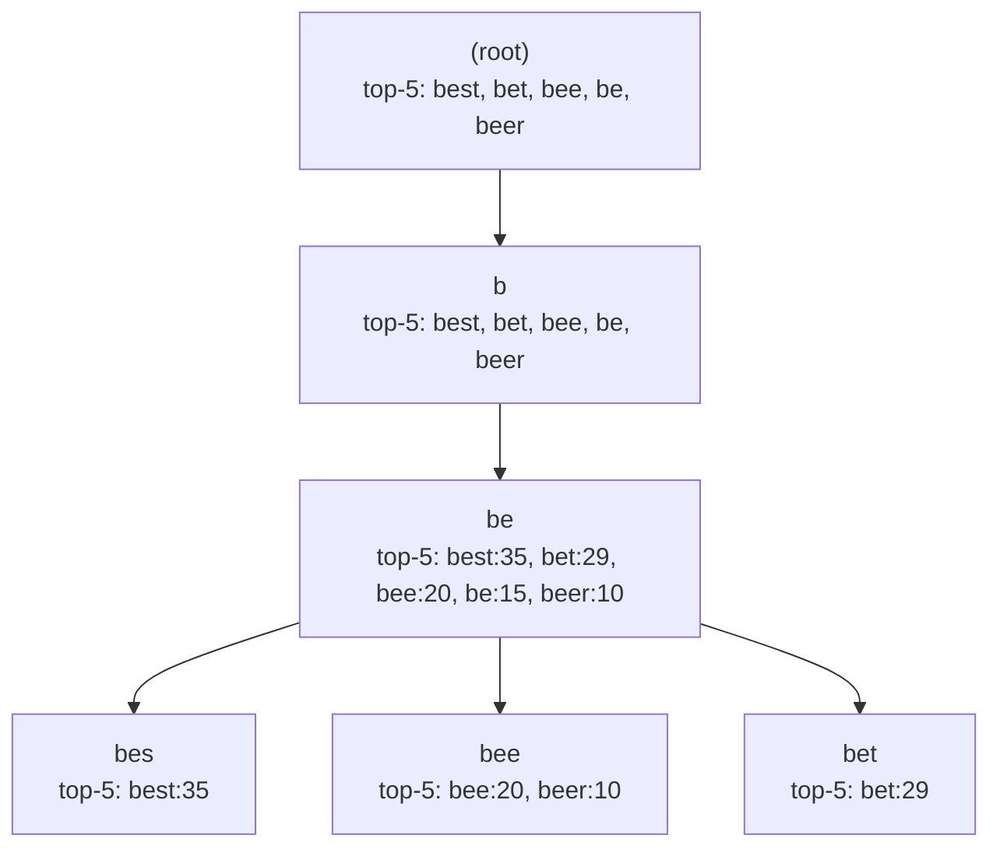

## Summary

**Top-K caching** is the critical optimization that makes trie-based autocomplete practical at scale. Instead of traversing an entire subtree to find the most popular completions for a prefix, the system pre-computes and **stores the top-k results directly at each trie node**. Combined with limiting the maximum prefix length, this reduces autocomplete lookup from O(p + c + c log c) to **O(1)**.

## How It Works

**Two optimizations combined**:

| Optimization | Before | After |
|---|---|---|
| Limit prefix length to ~50 chars | O(p) to find prefix node | O(1) -- bounded constant |
| Cache top-k at every node | O(c + c log c) to traverse and sort | O(1) -- just read the cache |

**Update propagation**: When a node's frequency changes, all ancestors up to the root must recalculate their cached top-k lists. This is why updates are done in batch (offline), not in real-time.

## When to Use

- Any **top-k query** system where the result set is relatively stable (does not change every second)
- Autocomplete where **response time < 100 ms** is required
- Systems with a high **read-to-write ratio** (many queries, infrequent index updates)

## Trade-offs

| Advantage | Disadvantage |
|-----------|-------------|
| O(1) lookup time for top-k results | Significant memory increase (top-k list at every node) |
| Eliminates subtree traversal entirely | Stale data between trie rebuilds |
| Simple read path (just look up cached list) | Update requires propagation through all ancestors |
| Works well with periodic batch rebuilds | Not suitable for real-time trending queries |

## Real-World Examples

- **Google Search autocomplete** caches results and serves them with `max-age=3600` browser cache headers
- **Amazon product search** typeahead caches popular completions at prefix nodes
- **Elasticsearch suggest API** uses a similar principle with completion suggesters that pre-index weighted suggestions

## Common Pitfalls

- **Setting k too large**: Storing top-100 at every node wastes enormous memory; 5-10 is typically sufficient
- **Forgetting ancestor propagation**: When a child frequency changes, all ancestors must update their cached lists or the results will be incorrect
- **Expecting real-time freshness**: This pattern is designed for periodic batch updates; for real-time trending, you need a separate fast path (e.g., streaming aggregation)
- **Not combining with prefix length limit**: Caching alone helps, but without the prefix length cap, the find-prefix step is still O(p)

## See Also

- [[trie-data-structure]]
- [[data-gathering-service]]
- [[query-service]]
