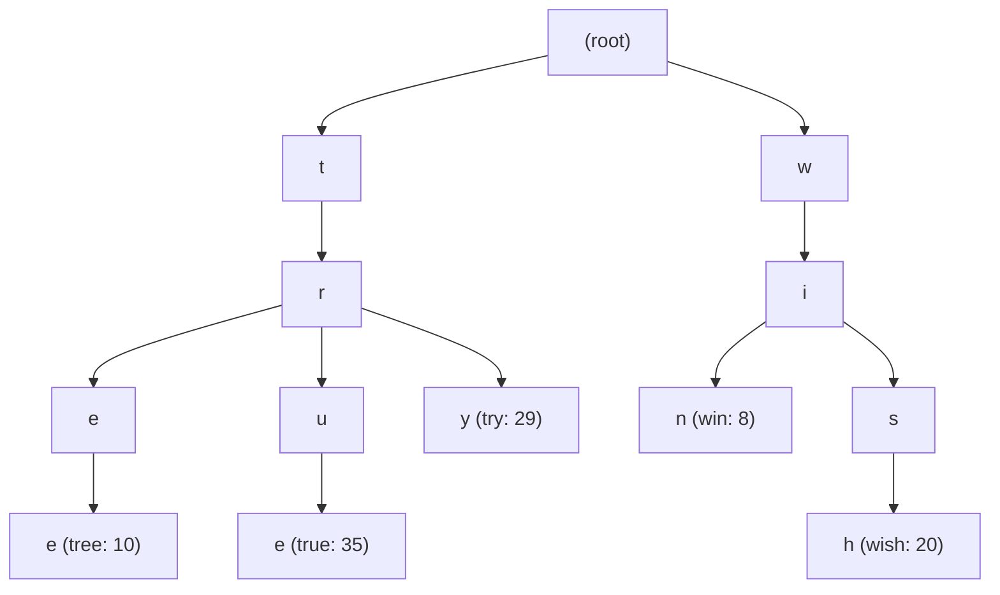

## Summary

A **trie** (pronounced "try", from re**trie**val) is a tree-like data structure optimized for storing and retrieving strings by prefix. Each node holds a single character and up to 26 children (for English lowercase). The root represents an empty string, and every path from root to a terminal node spells out a complete stored word. In the search autocomplete context, each node is augmented with a **frequency** count to rank query suggestions by popularity.

## How It Works

**Lookup algorithm (naive)**:
1. **Find the prefix node** by walking down character-by-character: O(p)
2. **Traverse the subtree** to collect all valid completions: O(c)
3. **Sort** completions by frequency and return top-k: O(c log c)

Total naive complexity: **O(p + c + c log c)**

With the two key optimizations (prefix length limit + top-k caching at each node), this becomes **O(1)**.

## When to Use

- **Search autocomplete / typeahead** systems
- **Prefix-based matching** (e.g., IP routing tables, phone directories)
- **Spell checkers** and dictionary lookups
- **Auto-suggestions** where you need ranked results by frequency

## Trade-offs

| Advantage | Disadvantage |
|-----------|-------------|
| Extremely fast prefix lookups (O(1) with caching) | High memory consumption, especially with top-k caching |
| Natural structure for prefix-based queries | Insertion/update requires propagating changes up to root |
| Compact shared prefixes reduce duplication | More complex than a hash table for exact-match lookups |
| Supports incremental character-by-character search | 26-way branching factor can waste space on sparse data |

## Real-World Examples

- **Google Search** autocomplete uses a trie-like structure to serve suggestions in < 100 ms
- **Facebook Typeahead** uses prefix-based data structures for user/page/group search
- **IDE code completion** (IntelliSense, TabNine) uses trie variants for symbol lookup
- **DNS resolution** uses trie-like structures for domain name prefix matching

## Common Pitfalls

- **Forgetting to cache top-k at nodes**: Without caching, every query must traverse the entire subtree, which is far too slow at scale
- **Naively using a relational DB instead**: SQL queries like `WHERE query LIKE 'prefix%' ORDER BY freq LIMIT 5` do not scale
- **Ignoring memory overhead**: A production trie for billions of queries needs careful memory management (e.g., compressed tries, key-value trie storage)
- **Real-time updates**: Mutating the trie on every query kills read performance; use offline batch rebuilds instead

## See Also

- [[top-k-caching-in-trie]]
- [[data-gathering-service]]
- [[query-service]]
- [[trie-sharding]]
