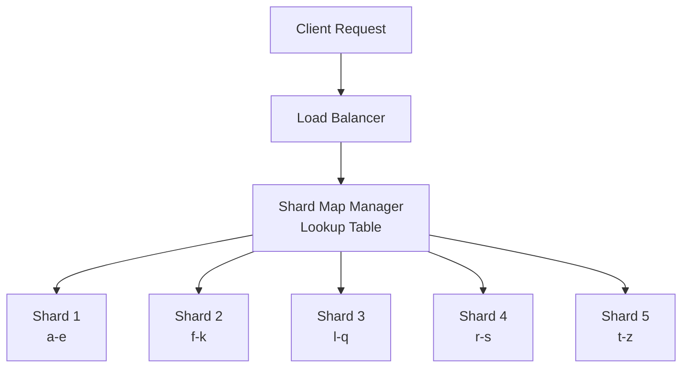

## Summary

When the trie grows too large for a single server, it must be **partitioned (sharded)** across multiple machines. Naive alphabetic sharding (a-m on one server, n-z on another) creates severe load imbalance because query distribution is highly uneven. A **shard map manager** analyzes historical query patterns and assigns prefix ranges to shards for balanced load distribution.

## How It Works

### Why naive sharding fails

The letter distribution of English queries is highly skewed:
- "s" and "c" prefixes may each have 10x more queries than "x" or "z"
- Splitting a-m / n-z puts most of the load on the first shard

### Smart sharding approach

1. Analyze **historical query distribution** to measure traffic per prefix
2. Build a **shard map** that assigns prefix ranges to servers based on equal load, not equal alphabet range
3. The shard map manager maintains a **lookup database** mapping each prefix range to its shard
4. The load balancer or a routing layer consults the shard map to direct requests

**Example**: If "s" alone has as many queries as "u" through "z" combined, "s" gets its own shard while "u-z" share one.

### Multi-level sharding

- **Level 1**: Shard by first character (up to 26 shards)
- **Level 2**: Shard by first two characters (up to 676 shards)
- **Level 3**: Shard by first three characters (up to 17,576 shards)

Each level allows finer-grained balancing but adds routing complexity.

## When to Use

- When the trie dataset exceeds the memory of a single server
- When query volume exceeds what a single server can handle (high QPS)
- When different prefix ranges have significantly different traffic patterns

## Trade-offs

| Advantage | Disadvantage |
|-----------|-------------|
| Balanced load across shards | Shard map manager adds operational complexity |
| Scales horizontally to handle growth | Resharding requires data migration |
| Each shard fits in memory | Cross-shard queries (if needed) are expensive |
| Can optimize shard placement per region | Shard map must be kept up-to-date with changing patterns |

## Real-World Examples

- **Elasticsearch** distributes index shards across nodes with configurable shard allocation awareness
- **Redis Cluster** uses hash slots (16,384 slots) with manual or automatic rebalancing
- **Cassandra** uses consistent hashing with virtual nodes to distribute data across a ring
- **Google Search** shards its index by document ID ranges with rebalancing based on query load

## Common Pitfalls

- **Sharding alphabetically without analyzing distribution**: Results in severe hotspots on popular prefixes
- **Hardcoding shard assignments**: Query patterns change over time; the shard map needs periodic rebalancing
- **Ignoring cross-shard fan-out**: If a single autocomplete request ever needs to query multiple shards, latency increases significantly
- **Not replicating the shard map**: The shard map manager is a single point of failure; it must be replicated

## See Also

- [[trie-data-structure]]
- [[top-k-caching-in-trie]]
- [[data-gathering-service]]
- [[query-service]]
