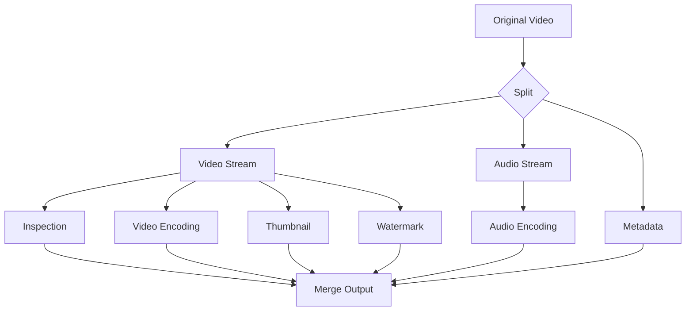

## Summary

A **DAG (Directed Acyclic Graph) processing model** defines video processing tasks as a graph of stages where edges represent dependencies. Tasks within the same stage can run in **parallel**, while stages execute **sequentially**. This model provides flexibility (content creators can define custom pipelines) and high parallelism (independent tasks run simultaneously). Facebook's streaming video engine (SVE) uses this approach.

## How It Works

### How it maps to the transcoding architecture

| DAG Concept | Architecture Component |
|---|---|
| DAG definition | Configuration files from client programmers |
| DAG generation | Preprocessor parses config into DAG |
| Stage splitting | DAG Scheduler decomposes into ordered stages |
| Task execution | Task Workers run individual tasks |
| Task scheduling | Resource Manager assigns tasks to workers |

### Example: two-stage pipeline

**Stage 1** (parallel): Split original video into video stream, audio stream, metadata
**Stage 2** (parallel within each stream):
- Video: encoding (720p, 1080p, 4K), thumbnail generation, watermark overlay, inspection
- Audio: audio encoding

All tasks within a stage can execute concurrently.

## When to Use

- **Video/media processing** pipelines with multiple independent transformation steps
- Any workflow where tasks have **dependency relationships** but also opportunities for parallelism
- Systems where different inputs need **different processing pipelines** (configurable DAGs)
- ETL pipelines, CI/CD pipelines, ML training workflows

## Trade-offs

| Advantage | Disadvantage |
|-----------|-------------|
| High parallelism -- independent tasks run concurrently | Complex scheduling and dependency tracking |
| Flexible -- different DAGs for different content | Configuration management overhead |
| Extensible -- add new task types without changing architecture | Debugging failed DAG runs is harder than linear pipelines |
| Stage-based execution enables clear progress tracking | Stage boundaries may introduce synchronization overhead |

## Real-World Examples

- **Facebook SVE** (Streaming Video Engine) uses DAG-based pipelines for video processing at scale
- **Apache Airflow** orchestrates complex data pipelines as DAGs
- **Apache Spark** represents computation as a DAG of stages for parallel execution
- **Kubernetes Jobs / Argo Workflows** define CI/CD and ML pipelines as DAGs
- **AWS Step Functions** model serverless workflows as state machines (similar to DAGs)

## Common Pitfalls

- **Overly granular tasks**: Too many tiny tasks create scheduling overhead; group related operations
- **Not handling task failures gracefully**: A failed task in one stage should not crash the entire pipeline; implement retries and partial re-execution
- **Ignoring resource contention**: If all stages try to use GPU workers simultaneously, the resource manager becomes a bottleneck
- **Static DAGs only**: Production systems benefit from dynamically generated DAGs based on input video properties (resolution, codec, duration)

## See Also

- [[video-transcoding]]
- [[video-uploading-flow]]
- [[video-system-optimizations]]
