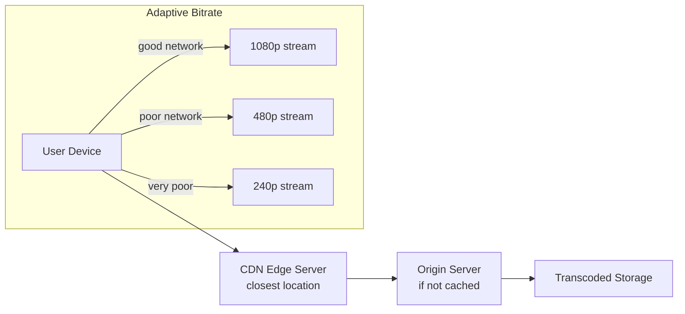

## Summary

**Video streaming** delivers video content to users by continuously sending small chunks of data rather than requiring a full download. Videos are served from **CDN edge servers** closest to the user for minimal latency. **Streaming protocols** (MPEG-DASH, HLS, etc.) enable adaptive bitrate switching based on network conditions. CDN cost is the dominant infrastructure expense, optimized through long-tail distribution analysis.

## How It Works

### Streaming protocols

| Protocol | Developer | Notes |
|----------|-----------|-------|
| **MPEG-DASH** | MPEG group | Dynamic Adaptive Streaming over HTTP; codec agnostic |
| **HLS** | Apple | HTTP Live Streaming; dominant on iOS/Safari |
| **Smooth Streaming** | Microsoft | Used in Azure Media Services |
| **HDS** | Adobe | HTTP Dynamic Streaming; declining usage |

All modern protocols work over HTTP and support adaptive bitrate switching.

### CDN cost optimization (long-tail strategy)

Video access follows a **long-tail distribution**: a small number of popular videos get most views, while most videos are rarely watched.

| Content Tier | Strategy |
|---|---|
| **Popular videos** (head) | Serve from CDN (low latency, high cost) |
| **Less popular** (long tail) | Serve from origin/high-capacity storage servers |
| **Regionally popular** | Cache in regional CDN only, not globally |
| **Short/unpopular** | Encode on-demand, not pre-encoded |

## When to Use

- Any video or audio streaming platform
- Systems where users expect immediate playback (no buffering)
- Global services with users across many geographies
- Platforms where bandwidth costs must be controlled

## Trade-offs

| Advantage | Disadvantage |
|-----------|-------------|
| CDN provides ultra-low latency globally | CDN is expensive ($0.02/GB adds up fast) |
| Adaptive bitrate ensures smooth playback | Requires multiple encoded versions of each video |
| Edge caching offloads origin servers | Cache invalidation for updated/deleted videos |
| HTTP-based protocols work through firewalls | Protocol fragmentation (HLS vs DASH vs others) |

## Real-World Examples

- **Netflix Open Connect** is a custom CDN with appliances deployed at ISP locations, reducing bandwidth costs and latency
- **YouTube** serves from Google's global CDN and dynamically switches quality based on detected bandwidth
- **Twitch** uses HLS for live streaming with ultra-low-latency extensions
- **Amazon CloudFront** serves as the CDN backbone for many streaming services

## Common Pitfalls

- **Serving all content from CDN**: The long-tail means most videos get few views; serving them from CDN wastes money
- **Not supporting adaptive bitrate**: Fixed-quality streams cause buffering on poor networks and waste bandwidth on good networks
- **Ignoring regional access patterns**: Distributing a locally viral video globally is wasteful; use regional CDN caching
- **Overlooking CDN cache warming**: New popular content may see initial latency if the CDN has not yet cached it
- **Not partnering with ISPs**: For very large scale, ISP partnerships (like Netflix Open Connect) can dramatically reduce costs

## See Also

- [[video-uploading-flow]]
- [[video-transcoding]]
- [[video-system-optimizations]]
