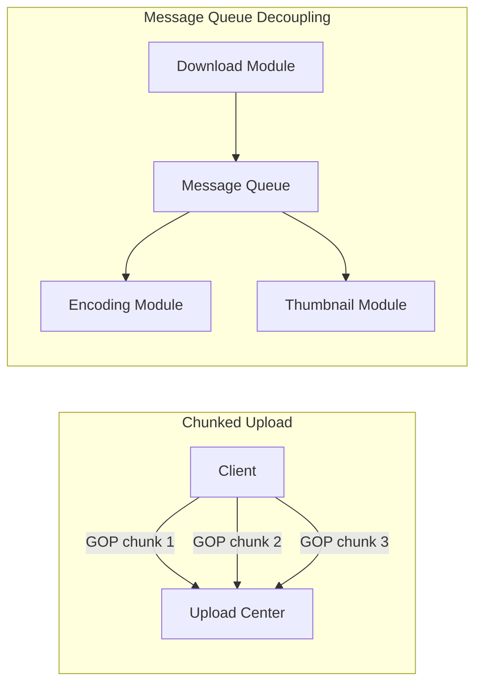
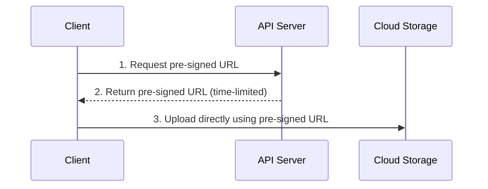

## Summary

A YouTube-scale video platform requires optimizations across three dimensions: **speed** (parallel GOP-aligned uploads, geo-distributed upload centers, message queues for pipeline decoupling), **safety** (pre-signed upload URLs, DRM, encryption, watermarking), and **cost** (long-tail CDN strategy, on-demand encoding, regional caching, ISP partnerships). These optimizations collectively make the difference between a prototype and a production system.

## How It Works

### Speed Optimizations

| Optimization | Mechanism |
|---|---|
| **Parallel chunked upload** | Client splits video into GOP-aligned chunks; each uploads independently; enables resumable upload |
| **Geo upload centers** | Place upload endpoints (CDN) close to users worldwide |
| **Message queues** | Decouple pipeline stages so encoding does not wait for download |

### Safety Optimizations

| Optimization | Mechanism |
|---|---|
| **Pre-signed URLs** | Client gets a time-limited, authorized URL for direct-to-storage upload |
| **DRM** | Apple FairPlay, Google Widevine, Microsoft PlayReady protect content |
| **AES encryption** | Encrypt video; decrypt only on authorized playback |
| **Visual watermarking** | Overlay identifying info to deter piracy |

### Cost Optimizations

| Optimization | Mechanism |
|---|---|
| **Long-tail CDN** | Only popular videos cached on CDN; others served from origin |
| **On-demand encoding** | Short or unpopular videos encoded only when first requested |
| **Regional CDN** | Regionally popular content cached only in relevant regions |
| **ISP partnerships** | Deploy CDN appliances at ISP edge (Netflix Open Connect model) |

## When to Use

- **Speed**: Any system handling large file uploads from diverse global locations
- **Safety**: Platforms with user-generated content requiring access control and copyright protection
- **Cost**: Systems where CDN/storage costs are a significant portion of infrastructure spend

## Trade-offs

| Optimization | Pro | Con |
|---|---|---|
| GOP chunked upload | Resumable, fast, parallel | Client-side complexity |
| Pre-signed URLs | Secure, direct upload | Extra API call for URL |
| DRM | Strong copyright protection | Complex integration, user friction |
| Long-tail CDN | Major cost savings | Higher latency for unpopular content |
| On-demand encoding | Saves storage for rarely-watched videos | First viewer experiences delay |
| ISP partnerships | Lowest possible latency and cost | Massive investment; only viable at Netflix/YouTube scale |
| Message queues | Loose coupling, independent scaling | Queue infrastructure and monitoring |

## Real-World Examples

- **YouTube** uses chunked resumable uploads with server-side GOP splitting for older clients
- **AWS S3 pre-signed URLs** are the standard pattern for secure direct uploads in cloud-native apps
- **Netflix Open Connect** deploys CDN appliances directly in ISP networks, serving 100% of streaming traffic
- **Twitch** uses regional ingest servers close to streamers for low-latency upload
- **Cloudflare Stream** offers on-demand encoding for smaller video platforms

## Common Pitfalls

- **Uploading entire video as one blob**: No resumability; a network interruption means starting over
- **Proxying all uploads through API servers**: Creates a bottleneck; pre-signed URLs let clients upload directly to storage
- **Serving all content from CDN**: The long-tail means most content is rarely watched; CDN for everything is wasteful
- **Ignoring DRM until after launch**: Retrofitting copyright protection is much harder than building it in from the start
- **Tightly coupling pipeline stages**: Without message queues, a slow encoding step blocks the entire pipeline

## See Also

- [[video-uploading-flow]]
- [[video-transcoding]]
- [[video-streaming]]
- [[dag-model]]
