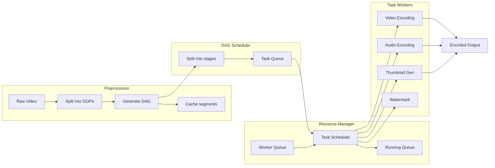

## Summary

**Video transcoding** (encoding) converts raw uploaded video into multiple formats, resolutions, and bitrates so it can play smoothly across diverse devices and network conditions. The architecture uses a **DAG (directed acyclic graph) model** to define flexible processing pipelines with high parallelism. Key components include a preprocessor, DAG scheduler, resource manager, task workers, and temporary storage.

## How It Works

### Key terminology

| Term | Definition |
|------|-----------|
| **Container** | File wrapper (.mp4, .avi, .mov) holding video, audio, and metadata |
| **Codec** | Compression algorithm (H.264, VP9, HEVC) that reduces file size |
| **GOP** | Group of Pictures -- an independently playable chunk (a few seconds) |
| **Bitrate** | Data rate; higher bitrate = higher quality = more bandwidth |

### Component responsibilities

| Component | What It Does |
|-----------|-------------|
| **Preprocessor** | Splits video into GOPs, generates DAG from config, caches segments for retry |
| **DAG Scheduler** | Decomposes DAG into ordered stages, enqueues tasks |
| **Resource Manager** | Matches highest-priority tasks to optimal workers |
| **Task Workers** | Execute actual encoding, thumbnailing, watermarking tasks |
| **Temporary Storage** | Holds metadata (in memory) and video/audio (in blob) during processing |

## When to Use

- Any platform serving video to heterogeneous devices (mobile, web, TV)
- Systems requiring **adaptive bitrate streaming** (multiple quality levels)
- Platforms where content creators have varying processing needs (watermarks, thumbnails, etc.)

## Trade-offs

| Advantage | Disadvantage |
|-----------|-------------|
| DAG model supports flexible, extensible pipelines | Complex orchestration and scheduling logic |
| GOP-level splitting enables parallel processing | Splitting and merging add overhead |
| Multiple output formats serve diverse devices | Storage multiplied per video (e.g., 5-10 encoded versions) |
| Resource manager optimizes worker utilization | Requires priority queues and monitoring infrastructure |
| Preprocessor caching enables retry on failure | Temporary storage must be cleaned up after processing |

## Real-World Examples

- **Facebook SVE** (Streaming Video Engine) uses a DAG-based processing model for video transcoding at scale
- **Netflix** encodes each title into 100+ streams with different resolutions and bitrates using its encoding pipeline
- **YouTube** transcodes uploads into multiple quality levels (144p to 4K) within minutes
- **AWS Elastic Transcoder** and **MediaConvert** offer managed transcoding with configurable job pipelines

## Common Pitfalls

- **Not splitting by GOPs**: Processing the entire video as one unit prevents parallelism and makes failures expensive (must restart from scratch)
- **Fixed pipeline for all videos**: Different content types (animation vs. live action) compress differently; a DAG model allows customization
- **Ignoring temporary storage cleanup**: Failed or completed jobs leave behind large temporary files that consume storage
- **Under-provisioning workers for peak**: Viral uploads can spike transcoding demand; use auto-scaling worker pools

## See Also

- [[dag-model]]
- [[video-uploading-flow]]
- [[video-streaming]]
- [[video-system-optimizations]]
