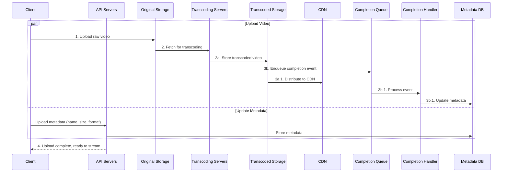

## Summary

The **video uploading flow** is the end-to-end pipeline for ingesting user-uploaded videos into a streaming platform. It runs two parallel processes: (1) upload the raw video to blob storage and trigger transcoding, and (2) update video metadata via API servers. After transcoding, encoded videos are distributed to CDN and the completion handler updates metadata to mark the video as ready for streaming.

## How It Works

### Key components

| Component | Role |
|-----------|------|
| **Original Storage** | Blob storage for raw uploaded video files |
| **Transcoding Servers** | Convert video to multiple formats/resolutions |
| **Transcoded Storage** | Blob storage for encoded output files |
| **CDN** | Edge-cached delivery of transcoded videos |
| **Completion Queue** | Message queue for transcoding completion events |
| **Completion Handler** | Workers that update metadata DB and cache on completion |
| **Metadata DB/Cache** | Stores video URL, size, resolution, format, user info |

## When to Use

- Any system that accepts user-generated video content (YouTube, TikTok, Vimeo)
- Platforms that need to serve video in multiple formats and resolutions
- Systems where upload and processing must be decoupled for scalability

## Trade-offs

| Advantage | Disadvantage |
|-----------|-------------|
| Parallel metadata and video upload saves time | Two parallel flows add coordination complexity |
| Async transcoding via queue decouples upload from processing | Video not immediately available after upload |
| CDN distribution ensures low-latency playback | CDN costs are substantial (see cost optimizations) |
| Completion queue enables reliable event handling | Queue infrastructure adds operational overhead |

## Real-World Examples

- **YouTube** uses a similar flow: upload to blob, transcode in parallel pipelines, distribute to CDN
- **Netflix** uploads content to S3, transcodes via their encoding pipeline, and serves from Open Connect CDN
- **Vimeo** and **Twitch** use resumable uploads with server-side transcoding to multiple quality levels
- **TikTok** optimizes for mobile upload with chunked upload and fast low-resolution preview generation

## Common Pitfalls

- **Blocking on transcoding before confirming upload**: Users should get an "upload complete" acknowledgment quickly; transcoding can finish asynchronously
- **Single point of failure in transcoding**: If transcoding servers go down, use completion queue for retry
- **Not separating original and transcoded storage**: Keeping raw originals allows re-transcoding when new codecs emerge
- **Ignoring metadata consistency**: Both metadata update and video upload must succeed; use the completion handler to reconcile state

## See Also

- [[video-transcoding]]
- [[video-streaming]]
- [[dag-model]]
- [[video-system-optimizations]]
