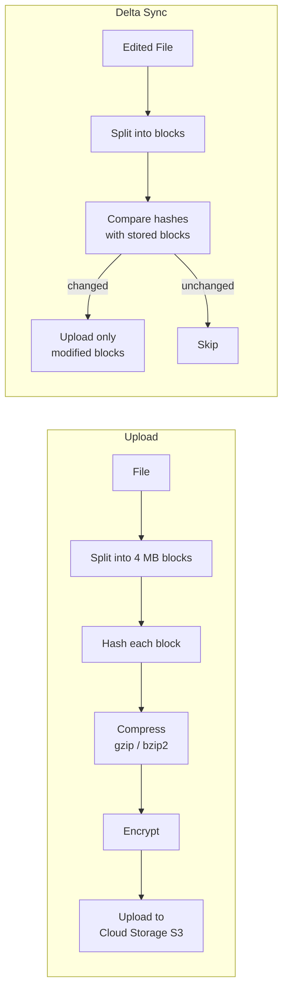

## Summary

**Block servers** are the core component that handles file uploads and downloads in a cloud storage system. Files are split into fixed-size **blocks** (typically 4 MB), each independently compressed, encrypted, and stored in cloud storage with a unique hash. On file edits, only **modified blocks** are transferred (delta sync), dramatically reducing bandwidth. Files are reconstructed by joining blocks in order using metadata.

## How It Works

### Delta sync example

A 100 MB file consists of 25 blocks (4 MB each). User edits content that affects blocks 2 and 5:

| Block | Status | Action |
|-------|--------|--------|
| Block 1 | Unchanged | Skip |
| Block 2 | **Modified** | Upload (4 MB) |
| Blocks 3-4 | Unchanged | Skip |
| Block 5 | **Modified** | Upload (4 MB) |
| Blocks 6-25 | Unchanged | Skip |

**Result**: Only 8 MB transferred instead of 100 MB (92% bandwidth reduction).

### Block processing responsibilities

| Step | Purpose |
|------|---------|
| **Splitting** | Break file into fixed-size blocks for parallel processing |
| **Hashing** | Generate unique identifier for deduplication and change detection |
| **Compression** | Reduce data size (algorithm depends on file type) |
| **Encryption** | Ensure security before cloud storage |
| **Upload** | Store block in cloud storage (S3) |

## When to Use

- Cloud file storage and sync services (Google Drive, Dropbox, OneDrive)
- Any system where large files are frequently edited with small changes
- Backup systems that need incremental updates
- Systems where bandwidth is expensive or limited (mobile networks)

## Trade-offs

| Advantage | Disadvantage |
|-----------|-------------|
| Delta sync saves massive bandwidth | Block management adds complexity |
| Deduplication across files/users saves storage | Hash computation has CPU cost |
| Parallel block upload/download | Block size tuning is critical (too small = overhead, too large = wasted transfer) |
| Independent encryption per block | Reassembly requires correct block ordering metadata |
| Resumable uploads at block level | Must track block-to-file-version mapping in metadata DB |

## Real-World Examples

- **Dropbox** uses 4 MB block size with delta sync, compressing and encrypting each block before storage on S3
- **rsync** algorithm detects changed blocks using rolling checksums for efficient file synchronization
- **Git** uses content-addressable storage with SHA hashes, conceptually similar to block-level deduplication
- **OneDrive** splits files into chunks for differential upload and supports resumable uploads

## Common Pitfalls

- **Syncing entire files on every change**: Without block-level delta sync, even tiny edits re-upload the full file
- **Wrong block size**: 4 MB is a good default; smaller blocks increase metadata overhead, larger blocks reduce delta sync efficiency
- **Not compressing before encrypting**: Encrypted data does not compress well; always compress first
- **Skipping encryption**: Cloud storage providers may have access to unencrypted data; client-side encryption is essential for security-sensitive files
- **No block-level retry**: If one block fails to upload, only that block should be retried, not the entire file

## See Also

- [[file-sync-and-conflict]]
- [[metadata-database]]
- [[notification-service]]
- [[storage-optimization]]
