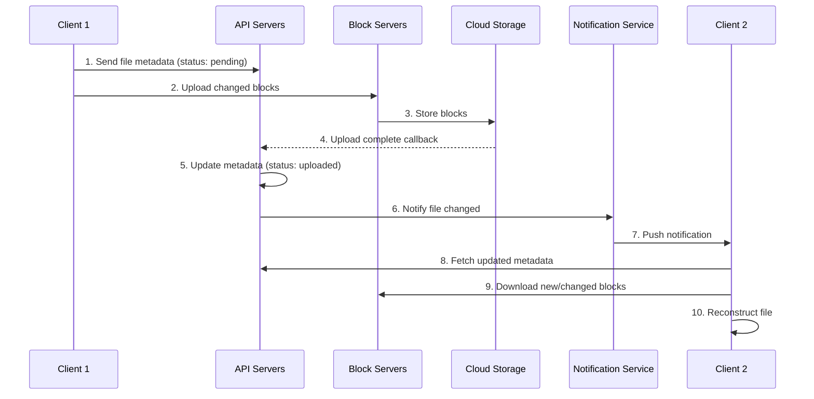
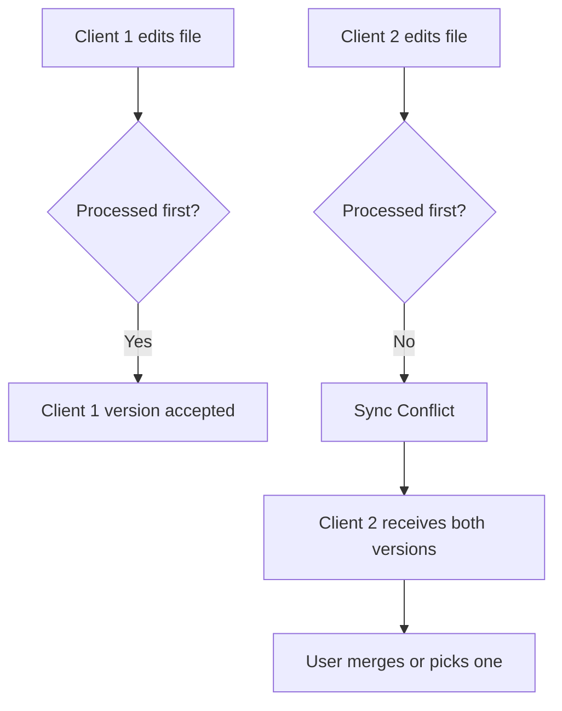

## Summary

**File synchronization** keeps files consistent across multiple devices. Changes are propagated via a notification service (long polling) that tells remote clients to pull updated metadata and download new/changed blocks. When two users edit the same file simultaneously, a **conflict** arises. The resolution strategy is **first write wins**: the first-processed version is accepted, and the second user receives both copies to merge manually.

## How It Works

### Upload and Sync Flow

### Conflict Resolution

**Rules**:
- The first version to be processed by the server wins
- The later version triggers a conflict notification to that client
- The client with the conflict sees both copies and decides how to resolve

## When to Use

- Multi-device file sync (cloud storage, note-taking apps)
- Collaborative file systems where multiple users share files
- Any system where concurrent edits to the same resource are possible

## Trade-offs

| Advantage | Disadvantage |
|-----------|-------------|
| First-write-wins is simple to implement | Second user must manually resolve conflicts |
| Notification service keeps all clients in sync | Long-polling connections consume server resources |
| Block-level sync minimizes data transfer | Conflict resolution UX can confuse non-technical users |
| Offline queue ensures no updates are lost | Offline clients may accumulate many conflicts |

## Real-World Examples

- **Dropbox** uses first-write-wins with conflicted copies saved as separate files (e.g., "file (conflicted copy).txt")
- **Google Drive** detects conflicts and shows a resolution dialog for Google Docs; for binary files, it keeps both versions
- **Git** uses three-way merge for conflict resolution, requiring manual resolution of conflicting hunks
- **OneDrive** creates "conflicting changes" copies for offline edit conflicts

## Common Pitfalls

- **Silently overwriting the second user's changes**: Always preserve both versions and notify the user
- **Not handling offline conflicts**: Users who edit while offline can create many conflicts when they reconnect; queue all changes and resolve in order
- **Assuming conflicts are rare**: In shared team folders, conflicts happen regularly; the UX must make resolution easy
- **Blocking sync on conflict**: Conflicts should not prevent other files from syncing; handle them independently
- **Not showing conflict history**: Users need to see what changed and who changed it to make informed merge decisions

## See Also

- [[block-server]]
- [[metadata-database]]
- [[notification-service]]
- [[storage-optimization]]
