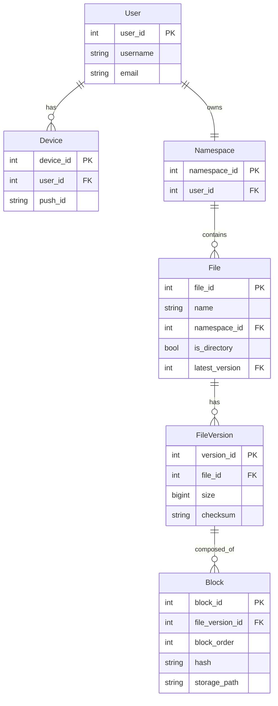

## Summary

The **metadata database** stores all information about users, devices, files, file versions, and blocks -- everything except the actual file content (which lives in cloud storage). The system requires **strong consistency** so all clients see the same file state. A **relational database** (with ACID guarantees) is chosen over NoSQL because consistency is non-negotiable. Metadata caches are **invalidated on every write** to prevent stale reads.

## How It Works

### Key design decisions

| Decision | Rationale |
|----------|-----------|
| **Relational DB** | ACID guarantees provide strong consistency natively |
| **File_Version is append-only** | Preserves revision history; existing rows never modified |
| **Block table stores hash** | Enables deduplication -- identical blocks share storage |
| **Device table with push_id** | Enables push notifications to all user devices |
| **Cache invalidation on write** | Ensures metadata cache and DB are always consistent |

### Strong consistency requirements

- All clients must see the **same file state** at any point in time
- Cache replicas must be consistent with the master database
- Cache is invalidated on every database write operation
- NoSQL databases do not support ACID by default; achieving consistency with NoSQL requires complex application-level logic

## When to Use

- Cloud storage systems where data integrity is paramount
- Any system where multiple clients must see a consistent view of shared resources
- File versioning systems that need reliable revision history
- Systems where cache consistency cannot be eventual

## Trade-offs

| Advantage | Disadvantage |
|-----------|-------------|
| Strong consistency via ACID | Relational DB is harder to horizontally shard |
| Append-only versions preserve history | Version table grows indefinitely without pruning |
| Block-level metadata enables dedup | Complex joins between File, FileVersion, Block tables |
| Cache invalidation ensures freshness | Every write invalidates cache, reducing cache hit rate |
| Familiar relational model | Schema changes require migrations |

## Real-World Examples

- **Dropbox** uses a relational database (historically MySQL) for file metadata with strong consistency
- **Google Drive** uses Spanner (globally distributed relational DB) for metadata with external consistency
- **iCloud** uses FoundationDB for metadata storage with ACID transactions
- **Box** uses MySQL with sharding for metadata at scale

## Common Pitfalls

- **Using eventual consistency for file metadata**: Users will see stale file lists, missing files, or duplicate files -- unacceptable for a storage product
- **Storing file content in the metadata DB**: Binary file data belongs in cloud storage (S3), not in the relational DB
- **Not making FileVersion append-only**: Mutable version records risk corrupting revision history
- **Forgetting cache invalidation**: Without invalidating cache on writes, clients may download stale file blocks
- **Single-region metadata DB**: For global availability, replicate metadata across regions (at the cost of replication lag)

## See Also

- [[block-server]]
- [[file-sync-and-conflict]]
- [[notification-service]]
- [[storage-optimization]]
