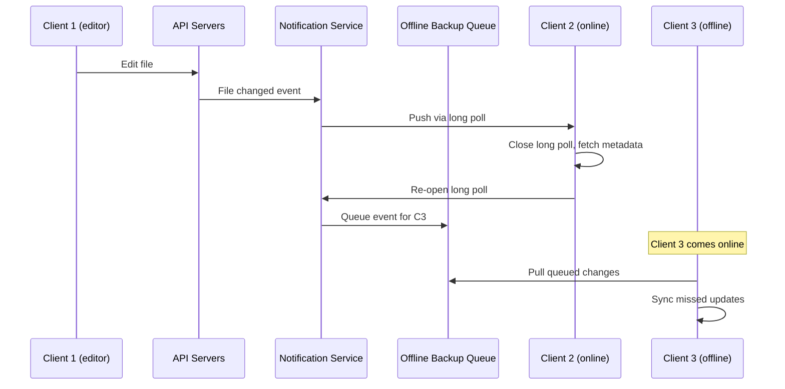

## Summary

The **notification service** is a publisher/subscriber system that informs clients when files are added, edited, or deleted by another user or device. It uses **long polling** (not WebSocket) because communication is unidirectional (server-to-client) and infrequent. Online clients maintain long-poll connections; when a file change event occurs, the server pushes the notification. Clients that are offline receive queued updates via an **offline backup queue** when they reconnect.

## How It Works

### Long polling vs WebSocket

| Factor | Long Polling | WebSocket |
|--------|-------------|-----------|
| **Direction** | Server-to-client (sufficient) | Bidirectional (unnecessary for file sync) |
| **Data frequency** | Infrequent file change events | Designed for high-frequency real-time data |
| **Complexity** | Simpler implementation | Requires persistent connection management |
| **Best for** | File sync notifications | Chat apps, gaming, live collaboration |
| **Dropbox** | Uses long polling | -- |

### Long polling lifecycle

1. Client opens HTTP request to notification server
2. Server **holds the connection** open (does not respond immediately)
3. When a file change event occurs, server sends the response
4. Client processes the notification, fetches metadata, downloads blocks
5. Client immediately opens a **new long-poll connection**
6. If no event occurs within timeout, server sends empty response; client reconnects

### Offline backup queue

- Stores pending notifications for offline clients
- When client reconnects, it pulls all queued events and syncs
- Queue is replicated for reliability

## When to Use

- File sync systems where clients need to know about remote changes
- Systems with infrequent, server-initiated notifications (not real-time chat)
- Multi-device sync where some devices may be offline
- Any pub/sub scenario where the subscriber is a user device

## Trade-offs

| Advantage | Disadvantage |
|-----------|-------------|
| Simpler than WebSocket for unidirectional notifications | Each client holds an open connection (resource-heavy at 1M+ connections) |
| Works through firewalls and proxies (standard HTTP) | Server must manage timeout and reconnection logic |
| Offline queue ensures no notifications are lost | Reconnecting all clients after server failure is slow |
| Sufficient for file sync (low-frequency events) | Not suitable for real-time bidirectional communication |

## Real-World Examples

- **Dropbox** uses long polling for file change notifications (reported 1M+ connections per server in 2012)
- **Google Drive** uses a combination of push notifications (mobile) and long polling (web) for sync
- **Slack** originally used long polling before migrating to WebSocket for real-time messaging
- **CouchDB** uses long polling for change feeds in database replication

## Common Pitfalls

- **Using WebSocket when long polling suffices**: WebSocket adds complexity for bidirectional communication that file sync does not need
- **Not handling server failure gracefully**: When a notification server goes down, all its long-poll connections are lost; clients must reconnect to a different server, which is slow
- **Forgetting the offline queue**: Without it, offline clients miss all changes and have no way to catch up
- **Not setting connection timeouts**: Long-poll connections must have timeouts to prevent resource leaks from abandoned clients
- **Overloading notification content**: Notifications should only signal "something changed"; the client should then fetch full metadata from the API

## See Also

- [[block-server]]
- [[file-sync-and-conflict]]
- [[metadata-database]]
- [[storage-optimization]]
