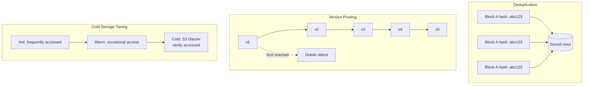

## Summary

Cloud storage systems accumulate massive amounts of data from file revisions, multi-device backups, and user uploads. Three techniques manage storage costs: **block deduplication** (identical blocks stored once and shared by reference), **intelligent backup strategy** (version limits and recency-weighted pruning), and **cold storage** (moving infrequently accessed data to cheaper tiers like S3 Glacier).

## How It Works

### Three optimization techniques

| Technique | How It Works | Savings |
|-----------|-------------|---------|
| **Block deduplication** | Hash each block; if hash already exists in storage, store only a reference, not a copy | Eliminates duplicate data across files, users, and versions |
| **Intelligent versioning** | Set a max version limit per file; weight recent versions more heavily; prune oldest | Prevents rapidly-edited files from consuming unbounded storage |
| **Cold storage** | Move data not accessed for months/years to cheaper storage tiers (e.g., S3 Glacier) | S3 Glacier costs ~$0.004/GB/month vs ~$0.023/GB/month for standard S3 |

### Deduplication in detail

Two blocks are considered identical if they have the **same hash value** (e.g., SHA-256). This works at the account level and can work across accounts:
- User uploads a file that is identical to one they already have -> no new blocks stored
- Multiple users upload the same popular document -> only one copy of shared blocks

### Version pruning strategy

For a file edited 1,000 times in one day:
- **Without pruning**: 1,000 versions stored, most nearly identical
- **With intelligent pruning**: Keep the 10 most recent versions plus hourly snapshots for the first day, daily snapshots for the first week, then weekly

## When to Use

- Any cloud storage system handling millions of users and petabytes of data
- File versioning systems where revision history grows without bound
- Systems where a significant portion of stored data is rarely accessed
- Platforms where storage cost is a major infrastructure expense

## Trade-offs

| Advantage | Disadvantage |
|-----------|-------------|
| Deduplication can save 30-50% storage | Hash computation adds CPU overhead per block |
| Version limits prevent unbounded growth | Users may want old versions that were pruned |
| Cold storage is 5-10x cheaper | Retrieval from cold storage takes minutes to hours |
| Combined techniques reduce costs dramatically | Implementation complexity across three systems |

## Real-World Examples

- **Dropbox** uses block-level deduplication across users, reportedly saving significant storage
- **AWS S3 Lifecycle Policies** automatically transition objects to Glacier based on age
- **Google Drive** limits version history to 100 versions or 30 days for non-Google-format files
- **Backblaze B2** uses content-addressable storage for deduplication in their backup service
- **ZFS and Btrfs** file systems support block-level deduplication natively

## Common Pitfalls

- **File-level deduplication only**: Two files that share 90% of content will still be stored twice; block-level dedup catches the shared blocks
- **No version limit**: A script that saves a file every second will generate 86,400 versions per day, consuming massive storage
- **Moving everything to cold storage too aggressively**: If users frequently access "old" files, retrieval latency from Glacier will cause poor UX
- **Not considering dedup hash collisions**: Use strong hash functions (SHA-256); weak hashes risk treating different blocks as identical
- **Ignoring metadata storage cost**: Even with dedup, the metadata entries (block hashes, version records) themselves consume database space

## See Also

- [[block-server]]
- [[file-sync-and-conflict]]
- [[metadata-database]]
- [[notification-service]]
