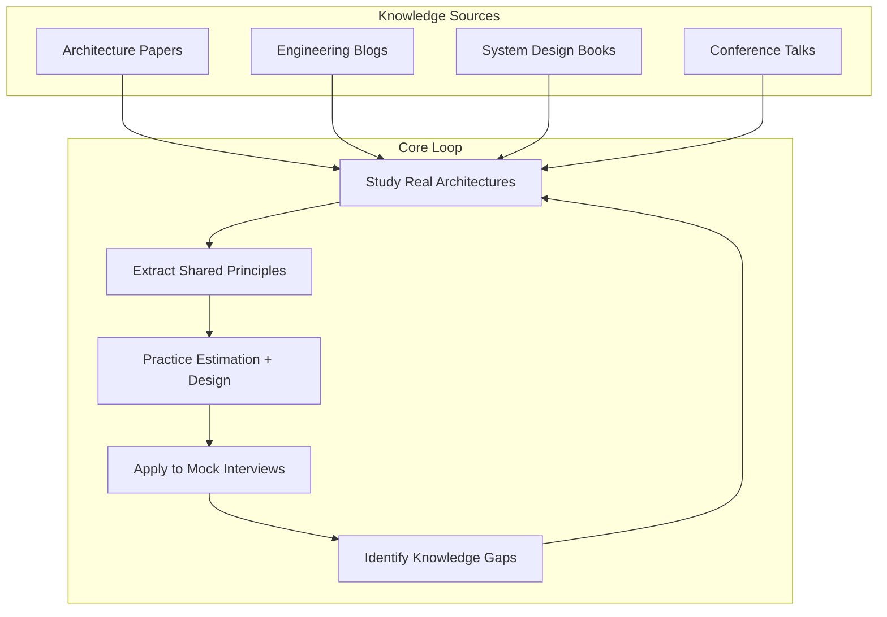

## Summary

Effective system design skill is **accumulated knowledge built over years**, not a set of patterns to memorize before an interview. The most effective shortcut is to study real-world architectures with a focus on **shared principles** and **understanding what problem each technology solves**. This concept outlines a practical study plan combining architecture papers, engineering blogs, estimation practice, and mock interviews.

## How It Works

### Practical study plan

| Action | Frequency | Purpose |
|--------|-----------|---------|
| Read 1-2 architecture papers/posts | Weekly | Deep understanding of production systems |
| Follow 3-5 engineering blogs (RSS/email) | Ongoing | Stay current with industry practices |
| Practice back-of-envelope estimation | Per design exercise | Build estimation muscle memory |
| Mock interview a full system design | Weekly | Apply knowledge under time pressure |
| Review and update personal notes | After each study session | Reinforce retention, build pattern library |

### The three levels of understanding

| Level | Description | Example |
|-------|-------------|---------|
| **What** | Know the technology exists | "Kafka is a message queue" |
| **How** | Understand the mechanism | "Kafka uses partitioned, replicated commit logs" |
| **Why** | Know what problem it solves and its trade-offs | "Kafka provides durable, ordered, replayable event streams; trade-off is complexity vs. simpler queues like SQS" |

The goal is to reach the **"why" level** for as many technologies as possible.

## When to Use

- Ongoing professional development (not just interview prep)
- Transitioning from application development to infrastructure/platform roles
- Preparing for senior or staff-level interviews where depth is tested
- Building expertise in a new domain (e.g., moving from web to distributed systems)

## Trade-offs

| Advantage | Disadvantage |
|-----------|-------------|
| Builds lasting intuition, not memorized answers | Requires sustained commitment over months/years |
| Transferable across companies and domains | Information overload if not curated |
| Connects theory to practice | Some papers are dense and time-consuming |
| Makes interviews feel like conversations, not tests | Hard to measure progress in the short term |

## Real-World Examples

- Engineers who regularly read the **Netflix Tech Blog** can naturally discuss resilience patterns, chaos engineering, and microservice decomposition in interviews
- Studying the **Amazon Dynamo paper** builds deep understanding of consistency, availability, and partition tolerance that applies to any distributed system
- Practicing **back-of-envelope estimation** weekly makes the estimation step of design interviews automatic rather than stressful
- Engineers who do **weekly mock interviews** report significantly more confidence and structured thinking

## Common Pitfalls

- **Cramming before interviews**: System design cannot be crammed; start studying months in advance
- **Memorizing solutions instead of principles**: Interviewers test your ability to reason about trade-offs, not recall specific architectures
- **Only studying theoretical patterns**: Without real-world examples, patterns feel abstract and hard to apply
- **Studying alone without feedback**: Mock interviews with peers or mentors reveal blind spots you cannot see yourself
- **Ignoring estimation practice**: Many candidates struggle with back-of-envelope math because they never practice it

## See Also

- [[real-world-system-architectures]]
- [[engineering-blogs]]
