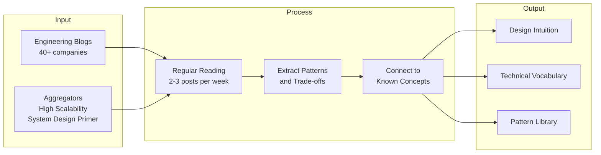

## Summary

**Company engineering blogs** are the best ongoing source of system design knowledge. They provide deep dives into production systems, explain trade-offs made under real constraints, and cover emerging technologies. Reading them regularly builds the intuition needed for both system design interviews and real-world engineering decisions. The chapter lists blogs from 40+ companies spanning infrastructure, social, e-commerce, and fintech.

## How It Works

### Top-tier blogs for system design

| Blog | Focus Areas |
|------|------------|
| **Netflix Tech Blog** | Streaming infrastructure, microservices, resilience engineering, A/B testing |
| **Meta Engineering** | Social graph, real-time systems, ML infrastructure, data platforms |
| **Google Developers** | Distributed systems, search, cloud infrastructure, SRE |
| **Uber Engineering** | Real-time systems, geospatial, marketplace algorithms |
| **Stripe Engineering** | Payments, API design, reliability, distributed systems |
| **Slack Engineering** | Real-time messaging, scaling WebSocket connections |
| **LinkedIn Engineering** | Feed ranking, distributed data infrastructure, search |
| **Dropbox Tech** | File sync, storage optimization, desktop client engineering |
| **Pinterest Engineering** | Recommendation systems, image processing, scaling |
| **Shopify Engineering** | E-commerce at scale, Ruby/Rails infrastructure |

### Aggregator resources

| Resource | Value |
|----------|-------|
| **High Scalability** | Curated architecture case studies and analysis |
| **System Design Primer** (GitHub) | Open-source study guide with examples and references |
| **InfoQ** | Architecture talks and case studies from conferences |

## When to Use

- Continuous learning for system design skills (not just interview prep)
- Researching how a specific company solves a problem before an interview with them
- Staying current with industry best practices and emerging technologies
- Building a personal pattern library of architectural approaches

## Trade-offs

| Advantage | Disadvantage |
|-----------|-------------|
| Free, continuously updated content | Quality varies; some posts are marketing-heavy |
| Written by engineers who built the systems | May omit failures and negative results |
| Covers cutting-edge technologies | Can be overwhelming in volume |
| Company-specific context useful for interviews | Niche solutions may not generalize |

## Real-World Examples

- **Netflix's "Zuul 2" blog post** explains their API gateway evolution and is widely referenced in gateway design discussions
- **Uber's "Schemaless" series** influenced how many companies think about schema-flexible storage
- **Stripe's "Idempotency Keys" post** became the go-to reference for idempotent API design
- **Slack's "Scaling to Millions of Connections" post** is essential reading for WebSocket architecture

## Common Pitfalls

- **Only reading blogs from one company**: Different companies face different constraints; diversify your reading
- **Passive reading without note-taking**: Extract key patterns and trade-offs into your own knowledge base
- **Treating blog posts as gospel**: Posts represent one point in time; architectures evolve and what worked for one company may not work for yours
- **Reading only during interview prep**: The most valuable learning comes from consistent, ongoing reading

## See Also

- [[real-world-system-architectures]]
- [[continuous-learning-strategy]]
