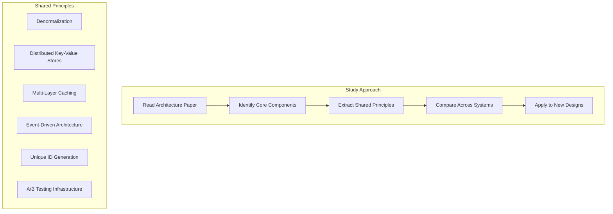

## Summary

Studying **published architectures from real companies** is one of the most effective ways to build system design expertise. These case studies reveal shared principles (denormalization, distributed storage, caching, unique ID generation) that appear across very different systems. The chapter curates architecture papers and talks from Facebook, Amazon, Netflix, Google, Twitter, Uber, Pinterest, LinkedIn, Dropbox, and others.

## How It Works

### Key architecture references by company

| Company | System | Key Lessons |
|---------|--------|-------------|
| **Facebook** | Timeline, Chat, Haystack (photos), Memcache, TAO (social graph) | Denormalization, caching at scale, graph storage |
| **Amazon** | Dynamo, overall architecture | Eventually consistent key-value stores, service-oriented architecture |
| **Netflix** | Full stack on AWS, experimentation platform, recommendations | Cloud-native architecture, A/B testing, ML pipelines |
| **Google** | GFS, Bigtable, Differential Sync (Docs), YouTube | Distributed file systems, structured storage, real-time collaboration |
| **Twitter** | Scaling to 150M users, Snowflake, Timelines at Scale | ID generation, fan-out on write vs read, timeline materialization |
| **Others** | Instagram, Uber, Pinterest, LinkedIn, Dropbox, WhatsApp, Flickr | Real-time markets, image processing, file sync, messaging at scale |

### Shared principles across these systems

| Principle | Where It Appears |
|-----------|-----------------|
| **Denormalization** | Facebook Timeline, Twitter Timelines |
| **Distributed KV stores** | Amazon Dynamo, Google Bigtable |
| **Caching layers** | Facebook Memcache, every system at scale |
| **Event-driven / queues** | Every async processing pipeline |
| **Unique ID generation** | Twitter Snowflake, used widely |
| **Sharding** | Every large-scale data system |

## When to Use

- Preparing for system design interviews
- Designing a new system and looking for battle-tested patterns
- Understanding how specific companies solved scalability challenges
- Building intuition for common architectural trade-offs

## Trade-offs

| Advantage | Disadvantage |
|-----------|-------------|
| Real production experience, not theory | Papers may be outdated (architectures evolve) |
| Reveals practical trade-offs and failures | Company-specific context may not generalize |
| Shows how principles compose into systems | Requires significant time investment |
| Builds pattern recognition across domains | Some papers omit key details for competitive reasons |

## Real-World Examples

- **Amazon Dynamo paper** (2007) influenced the design of Cassandra, Riak, and DynamoDB
- **Google GFS/MapReduce/Bigtable** papers launched the entire Hadoop ecosystem
- **Facebook TAO** inspired graph-aware caching in many social platforms
- **Twitter Snowflake** ID generation is now a standard pattern used across the industry
- **Netflix's architecture on AWS** became the blueprint for cloud-native microservices

## Common Pitfalls

- **Reading without extracting principles**: The goal is not to memorize architectures but to understand recurring patterns
- **Assuming one architecture fits all**: Each system was designed for specific constraints; blindly copying is dangerous
- **Only reading old papers**: Architecture evolves; supplement classic papers with recent engineering blog posts
- **Ignoring the "why"**: Understanding why a choice was made (not just what was chosen) is what builds design intuition

## See Also

- [[engineering-blogs]]
- [[continuous-learning-strategy]]
