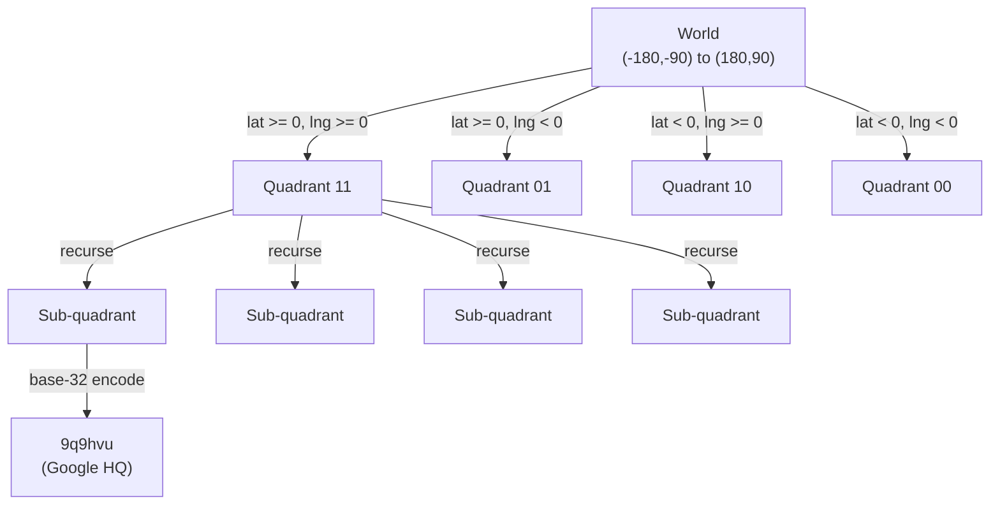

## Summary

Geohash is a hierarchical spatial encoding that converts a latitude/longitude pair into a short base-32 string. It works by recursively bisecting the coordinate space -- alternating between longitude and latitude bits -- and encoding each subdivision. The longer the shared prefix between two geohashes, the closer the two points are (with important boundary exceptions). Geohash is simple to implement, SQL-friendly, and widely used by Redis, MongoDB, and Elasticsearch.

## How It Works

1. Divide the world into 4 quadrants along the prime meridian and equator
2. Encode each quadrant as 2 bits (latitude bit + longitude bit)
3. Recursively subdivide, adding bits for finer precision
4. Convert the binary string to base-32 for a compact representation

| Geohash Length | Grid Size | Typical Use |
|---|---|---|
| 4 | 39.1 km x 19.5 km | 20 km radius search |
| 5 | 4.9 km x 4.9 km | 1-2 km radius search |
| 6 | 1.2 km x 609 m | 0.5 km radius search |

### Boundary Issues

- **No shared prefix:** Two points near the equator or prime meridian may have completely different geohashes despite being close (e.g., 30 km apart but no shared prefix)
- **Solution:** Always query the current cell **plus all 8 neighboring cells** (constant-time to compute)

## When to Use

- Proximity search with a known radius (find businesses within 5 km)
- When you need SQL-compatible spatial indexing (`WHERE geohash LIKE 'prefix%'`)
- When simplicity and ease of caching are priorities
- When data updates are frequent (O(1) insert/delete in a geohash index table)

## Trade-offs

| Benefit | Cost |
|---------|------|
| Simple to implement and explain | Fixed grid size per precision level |
| SQL-friendly (prefix matching) | Not adaptive to data density |
| Easy to cache at multiple precisions | Boundary issues require querying 9 cells |
| O(1) updates (insert/delete a row) | K-nearest queries need expanding search |
| Compact string representation | Precision levels are discrete, not continuous |

## Real-World Examples

- **Redis GEOHASH** -- Native geospatial commands for proximity search
- **MongoDB** -- 2DSphere index uses geohash internally
- **Elasticsearch** -- Geo-shape queries with geohash grid aggregation
- **Bing Maps** -- Uses geohash for spatial indexing
- **Lyft** -- Geosharded recommendations using geohash

## Common Pitfalls

- Querying only the current cell without neighbors (misses boundary businesses)
- Choosing the wrong precision level for the search radius
- Assuming shared prefix always means proximity (true) but forgetting the reverse is not always true
- Storing business IDs as a JSON array per geohash instead of one row per (geohash, business_id) -- the array approach requires locking and is harder to update

## See Also

- [[geospatial-indexing]] -- Overview of all spatial indexing approaches
- [[quadtree]] -- Alternative adaptive spatial index
- [[geospatial-caching]] -- Caching geohash results in Redis
