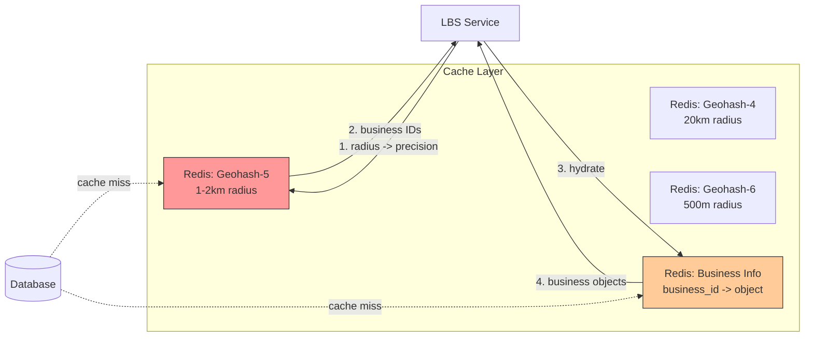

## Summary

Geospatial caching stores precomputed geohash-to-business-ID lists and business objects in Redis for sub-millisecond proximity lookups. The key insight is that geohash provides a natural, stable cache key -- small location changes still map to the same grid cell. By caching at multiple precision levels (lengths 4, 5, 6), the system efficiently serves different search radii without recomputation. Total memory for 200M businesses at 3 precisions is approximately 5 GB.

## How It Works

### Two types of cached data

1. **Geohash -> Business IDs:** Key is the geohash string, value is a list of business IDs in that cell
2. **Business ID -> Business Object:** Key is the business_id, value is the full business details

### Why geohash makes a good cache key

- Location coordinates from phones are imprecise and jittery
- A user moving slightly still maps to the same geohash cell
- All users in the same grid cell hit the same cache entry

### Cache invalidation

- Business changes are effective next day (business agreement)
- Nightly batch job updates the cache
- Low write volume means simple invalidation logic

## When to Use

- Read-heavy proximity search systems
- When location data is relatively static (businesses, POIs)
- When different search radii must be served efficiently
- When sub-millisecond lookup latency is required

## Trade-offs

| Benefit | Cost |
|---------|------|
| Sub-ms lookups vs database queries | ~5 GB Redis memory per precision |
| Stable cache keys from geohash | Up to 24h stale data with nightly refresh |
| Multiple precisions serve all radii | 3x storage for 3 precision levels |
| Simple invalidation with nightly job | Thundering herd if all keys expire at once |
| Globally deployable (same data everywhere) | Cross-region replication cost |

## Real-World Examples

- **Lyft** -- Geosharded recommendations with Redis geospatial caching
- **Uber** -- Caches driver locations using spatial hashing
- **Yelp** -- Caches search results by geographic grid
- **DoorDash** -- Caches restaurant availability by delivery zone

## Common Pitfalls

- Using raw (lat, lng) as cache keys -- too variable, causes cache misses
- Caching at only one precision level -- forces all searches to use the same grid size
- Expiring all cache keys simultaneously -- causes a cache stampede
- Not deploying Redis globally -- cross-continent cache lookups add significant latency
- Storing business IDs as a single JSON array per geohash -- harder to update atomically

## See Also

- [[geohash]] -- The spatial encoding that provides stable cache keys
- [[proximity-service-architecture]] -- The system architecture this caching supports
- [[geospatial-indexing]] -- Why spatial indexing is needed in the first place
