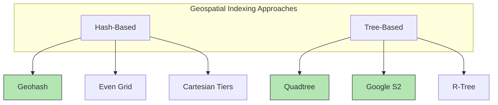

## Summary

Geospatial indexing transforms 2D location data (latitude, longitude) into structures that support fast spatial queries like "find all businesses within 5 km." The fundamental challenge is that standard database indexes work in one dimension, but location queries are inherently two-dimensional. Geospatial indexes solve this by mapping 2D space to 1D through hashing (geohash) or recursive spatial partitioning (quadtree, S2).

## How It Works

1. **Naive approach** -- Index latitude and longitude separately, then intersect results. This scans too much data and is inefficient.
2. **Hash-based** -- Encode 2D coordinates into a 1D string (geohash). Nearby points share prefixes. SQL-friendly.
3. **Tree-based** -- Recursively subdivide space into quadrants. Adaptive to data density. In-memory structures.

All approaches share the same high-level idea: divide the map into smaller areas and build indexes for fast search.

## When to Use

- Any system that needs proximity search (find nearby X)
- Location-based services: Yelp, Google Maps, Uber, Tinder
- Geofencing applications (detect users entering/leaving areas)
- Spatial joins in analytics (e.g., "orders per delivery zone")

## Trade-offs

| Benefit | Cost |
|---------|------|
| Fast spatial queries (sub-ms with caching) | Additional complexity vs simple lat/lng columns |
| Supports radius and k-nearest queries | Each approach has boundary edge cases |
| Scales to hundreds of millions of entries | In-memory solutions (quadtree, S2) consume server RAM |
| Multiple approaches for different needs | Must choose and commit to one approach early |

## Real-World Examples

- **Redis GEOHASH** -- Built-in geospatial commands using geohash internally
- **PostGIS** -- PostgreSQL extension with R-tree indexes for spatial queries
- **MongoDB** -- Native 2D and 2DSphere indexes using geohash
- **Elasticsearch** -- Geo-shape queries using both geohash and quadtree
- **Google S2** -- Used by Google Maps, Tinder for sphere-to-1D mapping

## Common Pitfalls

- Using naive 2D range queries with separate lat/lng indexes (intersection is slow)
- Forgetting boundary issues when using geohash (always query neighbors)
- Choosing an overly complex approach (S2) when geohash suffices
- Not considering data distribution -- even grids waste resources on oceans and deserts

## See Also

- [[geohash]] -- The most common hash-based geospatial index
- [[quadtree]] -- Adaptive tree-based spatial partitioning
- [[google-s2]] -- Sphere-based indexing with Hilbert curves
