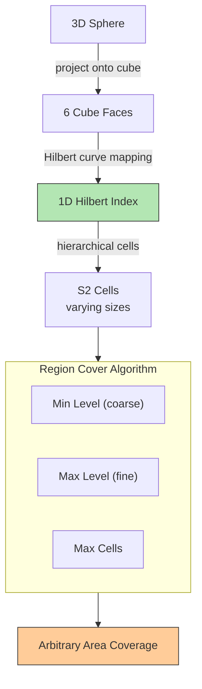

## Summary

Google S2 is a geometry library that maps a sphere to a 1D index using Hilbert curves (space-filling curves). Unlike geohash which works on a flat projection, S2 operates directly on the sphere, avoiding distortion at the poles. Its Region Cover algorithm can cover arbitrary areas with flexible cell sizes (min level, max level, max cells), making it ideal for geofencing. S2 is used by Google Maps and Tinder but is more complex to implement and explain than geohash or quadtree.

## How It Works

1. Project the sphere onto the 6 faces of a cube
2. Map each cube face to a 1D space using a Hilbert curve
3. The Hilbert curve preserves spatial locality -- nearby points on the sphere are nearby on the 1D index
4. Hierarchical cell decomposition allows cells of varying sizes
5. **Region Cover** algorithm covers any shape with a set of cells at optimal granularity

### Key Property: Spatial Locality

Two points close on the Hilbert curve are close in 2D space. This makes 1D range queries on the Hilbert index equivalent to spatial proximity queries, enabling efficient database lookups.

## When to Use

- Geofencing: defining virtual perimeters around real-world areas (school zones, delivery areas)
- When you need flexible cell sizes that adapt to query shapes
- When working with spherical geometry (avoids Mercator distortion)
- When the team has expertise with the S2 library

## Trade-offs

| Benefit | Cost |
|---------|------|
| Flexible cell sizes via Region Cover | More complex to implement and explain |
| Works on sphere directly (no projection distortion) | Harder to debug and visualize |
| Excellent for geofencing (covers arbitrary shapes) | Overkill for simple radius search |
| Proven at Google/Tinder scale | Niche library, less community support |
| Efficient 1D range queries | Steeper learning curve than geohash |

## Real-World Examples

- **Google Maps** -- Core spatial indexing for map services
- **Tinder** -- Geosharded user matching with S2 cells
- **Foursquare** -- Uses S2 for some spatial operations
- **Pokemon GO** -- S2 cells for game world partitioning

## Common Pitfalls

- Trying to explain S2 internals in a system design interview (too complex, prefer geohash/quadtree)
- Using S2 when a simple geohash prefix query would suffice
- Not understanding that S2 is an in-memory solution (similar to quadtree), not a database feature
- Confusing S2 cells with geohash grids -- S2 cells are on a sphere, geohash grids are on a flat plane

## See Also

- [[geospatial-indexing]] -- Overview of all spatial indexing approaches
- [[geohash]] -- Simpler alternative for flat-plane spatial encoding
- [[quadtree]] -- Another in-memory spatial index with adaptive resolution
