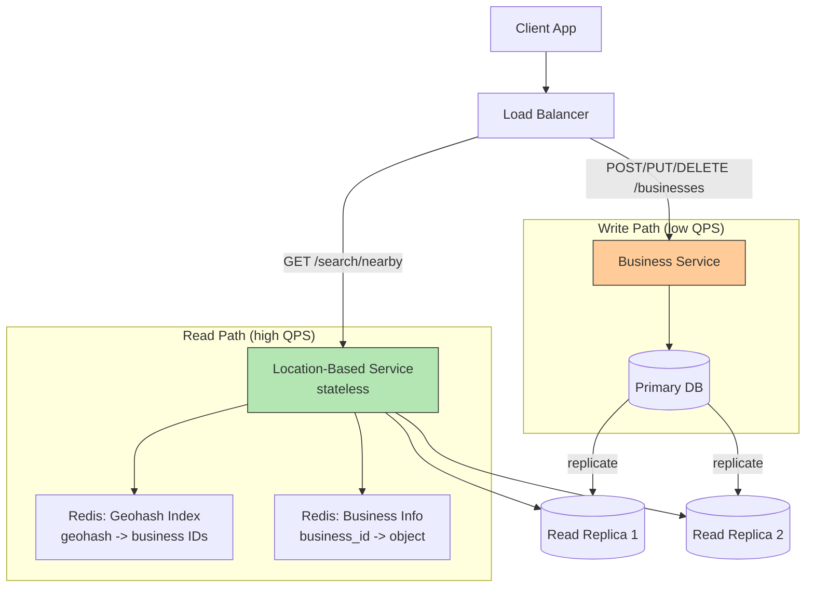

## Summary

The proximity service architecture separates the read-heavy Location-Based Service (LBS) from the write-path Business Service. LBS is stateless, handling ~5,000 search QPS by computing geohash lookups against Redis caches and database replicas. Business Service handles low-QPS CRUD operations against a primary database. Redis caches store both geohash-to-business-ID mappings and hydrated business objects. Multi-region deployment reduces latency and supports privacy law compliance.

## How It Works

### Search Flow

1. Client sends `(lat, lng, radius)` to LBS via load balancer
2. LBS maps radius to geohash precision (e.g., 500m -> length 6)
3. Computes geohash + 8 neighbors = 9 geohash cells
4. Queries Redis Geohash cache for business IDs (parallel)
5. Fetches business objects from Redis Business Info cache
6. Filters by actual distance, ranks, and returns results

## When to Use

- Read-heavy location search with relatively static data
- Systems where business data changes are infrequent (next-day effective)
- Services requiring sub-second search latency at high QPS
- Multi-region deployments for global coverage

## Trade-offs

| Benefit | Cost |
|---------|------|
| Stateless LBS scales horizontally | Cache invalidation complexity |
| Read replicas handle search load | Replication lag means slightly stale data |
| Redis cache provides sub-ms lookups | Additional infrastructure (Redis cluster) |
| Multi-region reduces latency | Cross-region data synchronization |
| Nightly batch cache update | Up to 24h stale data for new businesses |

## Real-World Examples

- **Yelp** -- Nearby business search with similar LBS + caching architecture
- **Google Places API** -- Geospatial search with multiple index types
- **Foursquare** -- Location-based discovery service
- **DoorDash** -- Restaurant discovery with proximity search

## Common Pitfalls

- Jumping to database sharding when read replicas suffice (geospatial index fits in ~5 GB)
- Not caching at multiple geohash precisions for different search radii
- Using location coordinates as cache keys (imprecise; use geohash instead)
- Invalidating all cache keys simultaneously in a nightly job (causes thundering herd)
- Neglecting to deploy across regions for global latency and privacy compliance

## See Also

- [[geospatial-indexing]] -- The core spatial indexing challenge this architecture solves
- [[geospatial-caching]] -- Redis caching strategy for geohash lookups
- [[geohash]] -- The spatial encoding powering the search index
