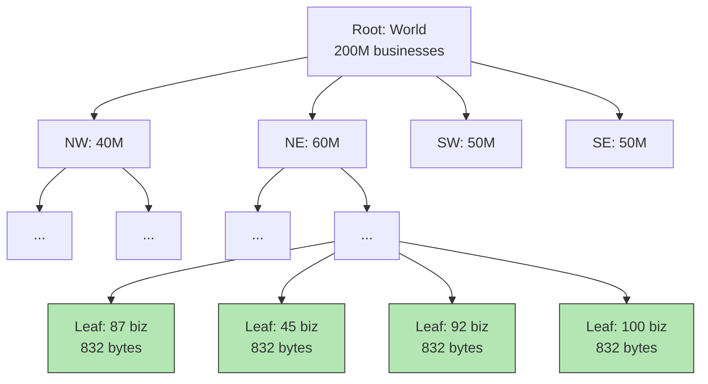

## Summary

A quadtree is an in-memory tree data structure that recursively subdivides 2D space into four quadrants until each leaf node meets a threshold (e.g., no more than 100 businesses). Unlike geohash's fixed grid, quadtree adapts to data density -- dense urban areas get finer subdivisions while sparse areas use larger cells. It requires ~1.7 GB memory for 200M businesses and takes a few minutes to build at server startup.

## How It Works

1. Start with the root node representing the entire world
2. If a node contains more than 100 businesses, subdivide into 4 children
3. Recurse until all leaf nodes have at most 100 businesses
4. **Leaf node:** coordinates (32 bytes) + up to 100 business IDs (800 bytes) = 832 bytes
5. **Internal node:** coordinates (32 bytes) + 4 child pointers (32 bytes) = 64 bytes

### Memory Calculation

- ~2M leaf nodes, ~0.67M internal nodes
- Total: 2M x 832 + 0.67M x 64 = ~1.71 GB

### Search Process

1. Traverse from root to the leaf containing the query point
2. If the leaf has enough businesses, return them
3. Otherwise, expand to neighboring leaves until enough results are found

## When to Use

- K-nearest neighbor queries ("find the 5 closest gas stations")
- When data density varies greatly (urban vs rural)
- When you need adaptive grid resolution
- When the dataset fits in memory on each server

## Trade-offs

| Benefit | Cost |
|---------|------|
| Adaptive to data density | More complex to implement than geohash |
| Natural fit for k-nearest queries | O(log n) updates with potential locking |
| Compact memory footprint (~1.7 GB) | Minutes-long build time at server startup |
| No boundary issues like geohash | Rebalancing on insert/delete is complex |
| Efficient for spatial range queries | Rolling deployments needed (can't serve during build) |

## Real-World Examples

- **Yext** -- Uses quadtree for location caching (published detailed blog post)
- **Game engines** -- Spatial partitioning for collision detection
- **Image processing** -- Recursive subdivision for variable-resolution encoding

## Common Pitfalls

- Not planning for the minutes-long startup time (use incremental rollouts, blue/green deploys)
- Allowing concurrent read/write access without locking (data structure corruption)
- Rebuilding the entire tree for every business update instead of using incremental updates or nightly batch
- Putting tons of strain on the database when an entire cluster fetches 200M businesses simultaneously during blue/green deploy

## See Also

- [[geospatial-indexing]] -- Overview of spatial indexing approaches
- [[geohash]] -- Simpler alternative with fixed grid sizes
- [[google-s2]] -- Sphere-based indexing with Hilbert curves
