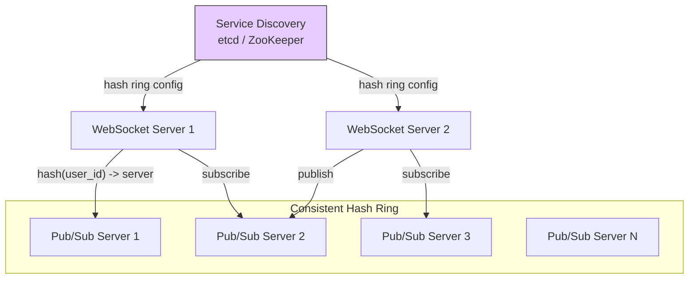

## Summary

To handle 14M location update pushes per second, Redis Pub/Sub channels must be distributed across 100+ servers. Channels are sharded using a consistent hash ring stored in service discovery (etcd/ZooKeeper). WebSocket servers cache the ring locally and subscribe to changes. The Pub/Sub cluster should be treated as stateful -- resizing causes mass channel migration and resubscription storms, so it should be over-provisioned and resized only during low-traffic periods.

## How It Works

### Publishing a Location Update

1. WebSocket server receives location update from user
2. Computes `hash(user_id)` against the cached hash ring
3. Determines which Pub/Sub server owns that channel
4. Publishes the location update to the channel on that server

### Subscribing to a Friend

Same process: `hash(friend_user_id)` determines which Pub/Sub server holds the friend's channel. Subscribe to that channel on that server.

### Resizing the Cluster

1. Determine new ring size, provision new servers
2. Update hash ring in service discovery
3. WebSocket servers receive notification, update local ring cache
4. Mass resubscription as channels move to new servers
5. Monitor CPU spike in WebSocket cluster

### Replacing a Dead Server

1. Monitoring detects dead Pub/Sub server
2. On-call operator updates hash ring to replace dead node with standby
3. Only channels on the dead server need resubscription (much less disruptive than full resize)

## When to Use

- When a single Pub/Sub server cannot handle the throughput
- When you need deterministic channel-to-server mapping
- When server failures must be handled without losing all channels
- When the cluster needs to scale (occasionally) to handle growth

## Trade-offs

| Benefit | Cost |
|---------|------|
| Even channel distribution | Resizing causes mass resubscription |
| Deterministic channel lookup | Requires service discovery infrastructure |
| Single server replacement is low-impact | Over-provisioning wastes resources during off-peak |
| WebSocket servers cache ring locally | Cache staleness during ring updates |
| Standard consistent hashing technique | Coordination overhead between WS servers and ring |

## Real-World Examples

- **Facebook** -- Distributed Pub/Sub for real-time features at massive scale
- **Discord** -- Consistent hashing for guild/channel server assignment
- **DynamoDB / Cassandra** -- Consistent hashing for data partitioning (same concept, different domain)

## Common Pitfalls

- Auto-scaling the Pub/Sub cluster like stateless servers (causes unnecessary resubscription storms)
- Not over-provisioning for peak traffic (forces risky resizing during high load)
- Resizing during peak hours (maximizes disruption and missed messages)
- Not having standby servers ready for quick single-server replacement
- Forgetting that WebSocket servers must subscribe to ring changes in service discovery

## See Also

- [[redis-pub-sub]] -- The underlying Pub/Sub mechanism being distributed
- [[nearby-friends-architecture]] -- The full system using this distributed Pub/Sub
- [[websocket-real-time]] -- WebSocket servers that interact with the Pub/Sub cluster
