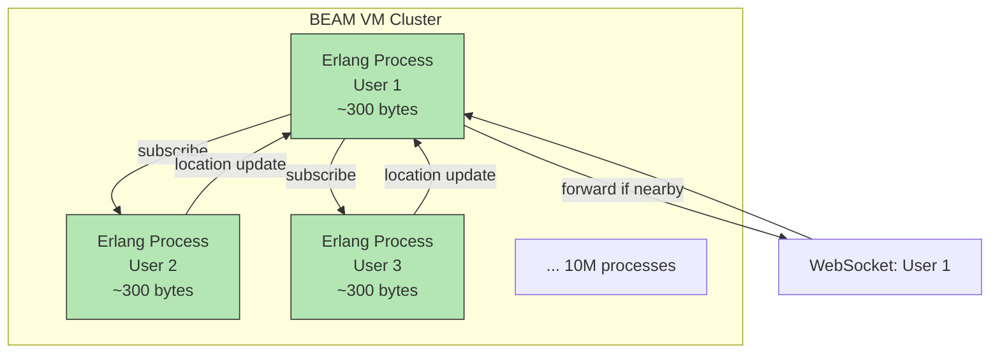

## Summary

Erlang (and its ecosystem: Elixir language, BEAM VM, OTP libraries) offers a compelling alternative to Redis Pub/Sub for the Nearby Friends routing layer. Each of the 10M active users can be modeled as a lightweight Erlang process (~300 bytes each). Processes natively support subscription and messaging, eliminating the need for an external Pub/Sub service entirely. The WebSocket servers and Pub/Sub logic can be unified into a single distributed Erlang application. The trade-off is that Erlang expertise is niche and hiring is difficult.

## How It Works

1. Each active user is represented by an **Erlang process** on the BEAM VM
2. A user's process receives location updates from the WebSocket connection
3. The process **subscribes** to each friend's process (native OTP subscription)
4. When a friend's location updates, the subscriber process is notified
5. The subscriber computes distance and forwards to the client if within radius

### Why Erlang Excels Here

- **Lightweight processes:** ~300 bytes each (vs. OS threads at ~1 MB). 10M processes is routine.
- **No CPU when idle:** Inactive processes consume zero CPU cycles
- **Native distribution:** Erlang nodes form clusters; processes communicate across nodes transparently
- **Fault tolerance:** OTP supervisors restart crashed processes automatically
- **Hot code loading:** Deploy updates without disconnecting users

## When to Use

- When the team has Erlang/Elixir expertise
- When you want to eliminate the Redis Pub/Sub infrastructure entirely
- When the application naturally models users as concurrent entities
- When you need built-in fault tolerance and distribution

## Trade-offs

| Benefit | Cost |
|---------|------|
| Eliminates Redis Pub/Sub entirely | Niche language, hard to hire |
| Processes are 3000x cheaper than OS threads | Steep learning curve for non-Erlang teams |
| Native clustering and distribution | Debugging distributed Erlang requires specific tooling |
| Built-in fault tolerance (OTP supervisors) | Different programming paradigm (functional, actor model) |
| Hot code loading for zero-downtime deploys | Less ecosystem support than mainstream languages |

## Real-World Examples

- **WhatsApp** -- Handles 2M+ connections per server using Erlang/BEAM
- **Discord** -- Uses Elixir for real-time messaging at massive scale
- **RabbitMQ** -- Message broker built on Erlang/OTP
- **Phoenix Framework** -- Elixir web framework with built-in channels (Pub/Sub)

## Common Pitfalls

- Choosing Erlang without team expertise (steep learning curve undermines development velocity)
- Underestimating the operational differences of BEAM VM vs. JVM/container environments
- Not leveraging OTP patterns (supervisors, gen_servers) and reinventing error handling
- Assuming Erlang solves all scaling problems (still needs proper architecture and monitoring)

## See Also

- [[redis-pub-sub]] -- The Redis-based alternative that Erlang replaces
- [[distributed-pub-sub]] -- The consistent hashing approach Erlang eliminates
- [[nearby-friends-architecture]] -- The full system where Erlang/BEAM fits
