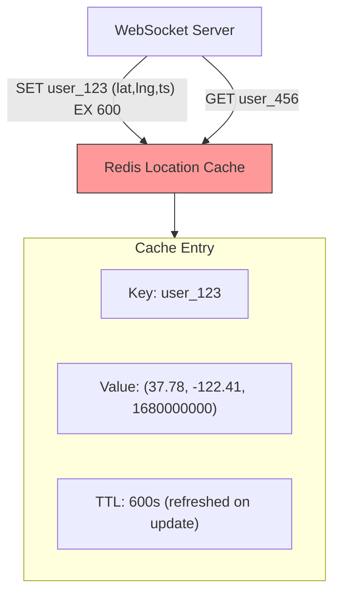

## Summary

A Redis cache stores the latest location for each active user as `key=user_id, value=(lat, lng, timestamp)`. Each entry has a TTL (Time-To-Live) that matches the inactivity timeout period. Every location update refreshes the TTL. When a user becomes inactive, their TTL expires and the entry is automatically removed -- no explicit cleanup needed. A single Redis server can hold 10M users (~1 GB), but 334K writes/sec requires sharding by user_id with standby replicas for availability.

## How It Works

1. On each location update, **SET** with the new position and **refresh TTL**
2. On initialization, **batch GET** all friends' locations (absent = inactive, TTL expired)
3. Connection handler also stores location in a local variable for fast distance calculations
4. If Redis instance dies, replace with empty instance -- cache warms up within one update cycle

### Sharding Strategy

- 10M users x ~100 bytes per entry = ~1 GB (fits in one server's memory)
- But 334K writes/sec exceeds single-server CPU capacity
- **Shard by user_id** across multiple Redis servers
- Add standby replicas for each shard (quick promotion on failure)

## When to Use

- Caching ephemeral data with natural expiration (user sessions, presence, location)
- When "last known" state is sufficient (no need for full history)
- When the dataset fits in memory but write throughput exceeds single-server capacity
- When automatic cleanup of stale entries is desired

## Trade-offs

| Benefit | Cost |
|---------|------|
| Automatic inactivity cleanup via TTL | No durability; data lost on crash |
| Sub-ms reads for distance computation | Sharding needed for write throughput |
| Simple key-value model | Stale data during cache warm-up after restart |
| Memory-efficient (~100 bytes/user) | Requires standby replicas for availability |
| No explicit user status tracking needed | TTL-based expiry is approximate (not instant) |

## Real-World Examples

- **Facebook** -- Location cache for Nearby Friends feature
- **Uber/Lyft** -- Redis cache for real-time driver locations
- **Online gaming** -- Player position caching with expiry
- **Session stores** -- User session data with TTL expiration

## Common Pitfalls

- Using a database instead of a cache (only current location matters, not history)
- Not refreshing TTL on each update (causes premature expiry for active users)
- Putting all users on a single Redis server (write throughput bottleneck)
- Expecting strong consistency after Redis restart (cache needs time to warm up)
- Not having standby replicas (single Redis failure makes all users appear offline)

## See Also

- [[websocket-real-time]] -- WebSocket servers that write to the location cache
- [[nearby-friends-architecture]] -- System context for the location cache
- [[redis-pub-sub]] -- Complements the cache for real-time message routing
