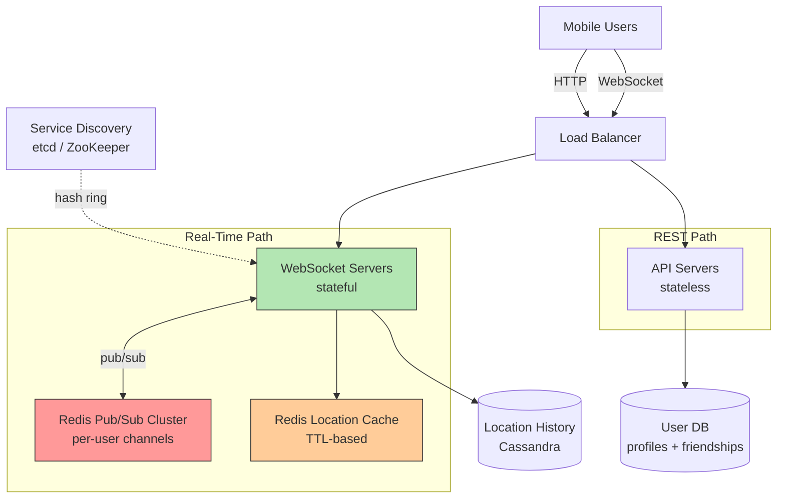

## Summary

The Nearby Friends architecture handles real-time location sharing at scale (10M concurrent users, 334K updates/sec, 14M fan-out/sec). It uses WebSocket servers for bi-directional real-time communication, Redis Pub/Sub as a lightweight message routing layer with per-user channels, Redis location cache with TTL for active user positions, Cassandra for location history, and a user database for profiles and friendships. Service discovery (etcd/ZooKeeper) manages the distributed Pub/Sub hash ring.

## How It Works

### Component Responsibilities

| Component | Role |
|---|---|
| WebSocket Servers | Persistent connections, distance computation, pub/sub interaction |
| Redis Pub/Sub | Route location updates from user to friends' handlers |
| Redis Location Cache | Latest position per user, TTL auto-expires inactive users |
| Cassandra | Append-only location history for analytics/ML |
| User DB | Profiles and friendship graph (sharded by user_id) |
| Service Discovery | Consistent hash ring for Pub/Sub server assignment |

### Data Flow

1. Client sends location via WebSocket
2. WebSocket server writes to Cassandra (history), Redis cache (latest), and publishes to Pub/Sub
3. Pub/Sub broadcasts to all friend subscribers
4. Each subscriber handler computes distance and conditionally pushes to client

## When to Use

- Real-time social features requiring location awareness
- Systems where users produce and consume frequent ephemeral updates
- Applications needing both real-time (WebSocket) and request/response (REST) paths
- Large-scale fan-out with millions of concurrent users

## Trade-offs

| Benefit | Cost |
|---------|------|
| Real-time sub-second updates | Stateful WebSocket servers complicate scaling |
| Lightweight Pub/Sub routing | No message persistence, occasional lost updates |
| TTL-based inactivity handling | Cache warm-up delay after Redis restart |
| Cassandra handles write-heavy history | Eventual consistency for historical data |
| Service discovery enables dynamic scaling | Resizing Pub/Sub cluster causes resubscription storms |

## Real-World Examples

- **Facebook Nearby Friends** -- The feature this design is based on
- **Snapchat Snap Map** -- Real-time friend location sharing
- **WhatsApp Live Location** -- Temporary location sharing with contacts
- **Find My Friends (Apple)** -- Friend location tracking

## Common Pitfalls

- Using HTTP polling instead of WebSocket (wastes bandwidth, higher latency)
- Putting all Pub/Sub channels on one Redis server (CPU bottleneck at 14M pushes/sec)
- Not using TTL on location cache (stale locations for inactive users)
- Aggressively auto-scaling the Pub/Sub cluster (treat as stateful, over-provision instead)
- Ignoring connection draining when scaling down WebSocket servers

## See Also

- [[websocket-real-time]] -- The transport layer for bi-directional communication
- [[redis-pub-sub]] -- The message routing layer
- [[distributed-pub-sub]] -- Scaling Pub/Sub with consistent hashing
- [[location-cache-ttl]] -- Redis cache for active user locations
- [[erlang-alternative]] -- BEAM VM as an alternative to Redis Pub/Sub
