## Summary

Redis Pub/Sub serves as a lightweight message routing layer where each user gets a dedicated channel. When a user's location updates, it is published to their channel and broadcast to all subscribed friends' WebSocket handlers. Channels are extremely cheap to create (~20 bytes per subscriber pointer), making it feasible to have 100M+ channels. Messages are fire-and-forget (not persisted), which is acceptable since occasional missed updates are tolerable for the Nearby Friends feature.

## How It Works

```mermaid
graph TB
    U1[User 1 updates location]
    WS1[WS Server A]
    CH1[Channel: user_1]

    WS2[WS Server B<br>User 2 handler]
    WS3[WS Server C<br>User 3 handler]
    WS4[WS Server B<br>User 4 handler]

    U1 --> WS1
    WS1 -->|PUBLISH| CH1
    CH1 -->|broadcast| WS2
    CH1 -->|broadcast| WS3
    CH1 -->|broadcast| WS4

    WS2 -->|if within radius| U2[User 2]
    WS3 -->|if within radius| U3[User 3]
    WS4 -->|drop if too far| X[dropped]

    style CH1 fill:#ff9999,stroke:#333
```

1. Each user who opts into Nearby Friends gets a **dedicated channel** (e.g., `user_123`)
2. When a user's location updates, their WebSocket server **publishes** to that user's channel
3. Each friend's WebSocket handler **subscribes** to the channel
4. On receiving a message, the handler computes distance and forwards if within radius
5. If the friend is out of range, the update is silently dropped

### Channel Properties

- **Creation:** A channel is created when someone subscribes to it (no setup needed)
- **Empty channels:** If a message is published to a channel with no subscribers, it is simply dropped
- **Memory:** Hash table + linked list per channel, ~20 bytes per subscriber pointer
- **No persistence:** Messages are not stored; if a subscriber is offline, they miss the message

### Subscribe Strategy

Subscribe to **all** friends' channels (active + inactive) on initialization. Inactive friends' channels use negligible resources (no messages flowing, just a small memory allocation). This avoids complex subscribe/unsubscribe logic when friends go online/offline.

## When to Use

- Fan-out messaging where messages are ephemeral (no replay needed)
- When millions of lightweight channels are needed
- When fire-and-forget delivery is acceptable
- When the routing pattern is "one publisher to many subscribers per user"

## Trade-offs

| Benefit | Cost |
|---------|------|
| Channels are extremely cheap to create | No message persistence (missed if offline) |
| Very low latency message delivery | No acknowledgment or retry mechanism |
| Simple publish/subscribe API | Messages lost if no subscribers |
| Scales to millions of channels | CPU becomes bottleneck at high fan-out |
| No topic management overhead | Memory grows with subscriber count |

## Real-World Examples

- **Facebook Nearby Friends** -- Per-user Pub/Sub channels for location fan-out
- **Real-time dashboards** -- Broadcasting metrics updates to viewers
- **Chat systems** -- Lightweight per-room message routing
- **Live notifications** -- Pushing events to subscribed clients

## Common Pitfalls

- Expecting message persistence or delivery guarantees (Redis Pub/Sub has neither)
- Using a single Redis server for high fan-out (CPU saturates before memory)
- Not sharding channels across multiple servers for high throughput
- Subscribing/unsubscribing dynamically on friend status changes (over-complicates; subscribe to all)
- Confusing Redis Pub/Sub with Redis Streams (Streams offer persistence; Pub/Sub does not)

## See Also

- [[distributed-pub-sub]] -- Scaling Pub/Sub across a cluster with consistent hashing
- [[websocket-real-time]] -- The transport layer that delivers Pub/Sub messages to clients
- [[nearby-friends-architecture]] -- Full system design using Redis Pub/Sub
