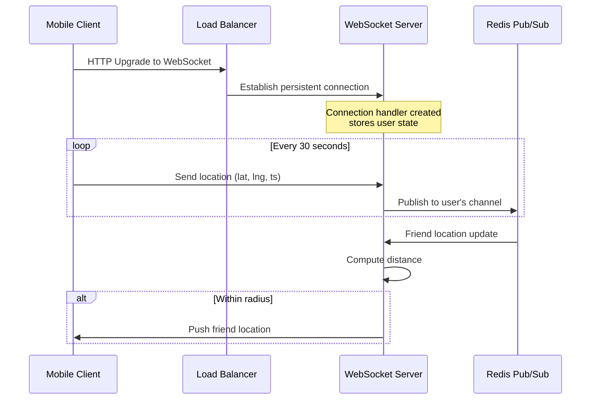

## Summary

WebSocket provides persistent, bi-directional connections between mobile clients and servers, enabling near real-time location updates for the Nearby Friends feature. Each client maintains one long-lived WebSocket connection. The server uses this connection to both receive location updates from the client and push friend location updates to the client. Unlike HTTP polling, WebSocket avoids repeated connection overhead and delivers sub-second latency.

## How It Works

1. Client establishes a WebSocket connection (HTTP upgrade handshake)
2. Server creates a **connection handler** that stores user state (current location, friend list)
3. Client sends periodic location updates (every 30s) over the connection
4. Server publishes updates to Redis Pub/Sub and receives friend updates
5. Server computes distances and pushes relevant friend locations back to the client

### Stateful Server Considerations

- WebSocket servers are **stateful** -- each connection is bound to a specific server
- Scaling down requires **connection draining** (mark server as draining, wait for connections to close)
- Rolling deployments must be done carefully to avoid dropping all connections
- Cloud load balancers handle stateful server management well

## When to Use

- Real-time features requiring server push (location updates, chat, live feeds)
- When bi-directional communication is needed (client sends AND receives)
- When low latency is critical (sub-second delivery)
- When persistent connections reduce overhead vs repeated HTTP requests

## Trade-offs

| Benefit | Cost |
|---------|------|
| True real-time, sub-second latency | Stateful servers, complex scaling |
| Bi-directional (send + receive) | Connection draining for graceful scale-down |
| Lower overhead than HTTP polling | Memory per connection on the server |
| Single connection per client | Load balancer must handle WebSocket protocol |
| Natural fit for location streaming | Rolling deploys require careful orchestration |

## Real-World Examples

- **Facebook Nearby Friends** -- WebSocket for real-time friend location updates
- **Slack / Discord** -- WebSocket for real-time messaging
- **Uber / Lyft** -- WebSocket for driver location tracking
- **Figma** -- WebSocket for real-time collaborative editing

## Common Pitfalls

- Treating WebSocket servers as stateless (they are stateful, require draining)
- Not implementing heartbeat/ping to detect stale connections
- Scaling down by abruptly killing servers (drops all active connections)
- Using WebSocket when Server-Sent Events (SSE) would suffice (one-way push only)
- Not handling reconnection logic on the client (network interruptions are common on mobile)

## See Also

- [[redis-pub-sub]] -- Message routing layer that WebSocket servers publish to and subscribe from
- [[nearby-friends-architecture]] -- The full system architecture using WebSocket
- [[location-cache-ttl]] -- Redis cache that WebSocket servers update with each location
