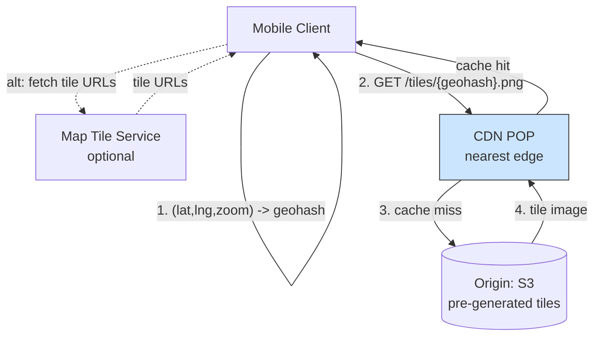

## Summary

Pre-generated, static map tiles are an ideal CDN workload. With ~200 POPs worldwide, the CDN serves map tiles from the nearest edge location, reducing latency to milliseconds. The client computes a geohash from `(lat, lng, zoom_level)` to construct the tile URL directly, avoiding a server round-trip. For 5 billion navigation minutes per day, the CDN serves ~62.5 GB/s total, which distributed across 200 POPs is only a few hundred MB/s per POP. An optional map tile service can provide URL construction flexibility at the cost of an extra network hop.

## How It Works

### Two Approaches

**Option A: Client-side geohash computation**
1. Client computes geohash from location + zoom level
2. Constructs tile URL: `cdn.example.com/tiles/{geohash}.png`
3. Fetches directly from CDN (no server round-trip)
4. Trade-off: algorithm hardcoded on client, hard to change

**Option B: Map tile service**
1. Client asks map tile service for tile URLs given location + zoom
2. Service returns URLs for the current tile + 8 surrounding tiles
3. Client fetches tiles from CDN using returned URLs
4. Trade-off: extra network hop, but easier to change tile encoding

### Data Usage Estimation

| Metric | Value |
|---|---|
| Speed | 30 km/h |
| Tile coverage | 200m x 200m |
| Tiles per km^2 | 25 |
| Data per hour | ~75 MB |
| Data per minute | ~1.25 MB |
| Total CDN throughput | ~62.5 GB/s |
| Per POP (200 POPs) | ~312 MB/s |

## When to Use

- Serving static, pre-generated content to global users
- When content is highly cacheable (same tile served to many users)
- When low latency is critical for user experience (smooth map panning)
- When the origin cannot handle the full request volume directly

## Trade-offs

| Benefit | Cost |
|---------|------|
| Sub-50ms latency from nearest POP | CDN bandwidth costs at 62.5 GB/s |
| Offloads origin servers completely for cached tiles | Cache miss latency is higher (round-trip to origin) |
| Client-side URL computation eliminates server hop | Hardcoded algorithm is risky to change on mobile |
| Map tile service adds flexibility | Extra network hop adds latency |
| Static tiles cache indefinitely | Stale tiles when map data updates |

## Real-World Examples

- **Google Maps** -- Google's global CDN serves map tiles worldwide
- **Mapbox** -- CDN-delivered vector and raster tiles
- **OpenStreetMap** -- Tile servers with CDN caching (Cloudflare, Fastly)
- **Apple Maps** -- CDN delivery of vector map data

## Common Pitfalls

- Generating map tiles on-the-fly per request (defeats CDN caching, overloads servers)
- Not pre-fetching surrounding tiles (user pans and sees blank areas)
- Serving tiles only from origin without CDN (high latency for distant users)
- Hardcoding tile URL algorithm without a fallback service (stuck if algorithm needs changing)
- Not setting appropriate cache headers (tiles are static; cache aggressively)

## See Also

- [[map-tiling]] -- The pre-generation process that creates the tiles served by CDN
- [[navigation-service]] -- Uses map tiles to display routes to the user
- [[geocoding]] -- Converts addresses to coordinates for tile lookup
