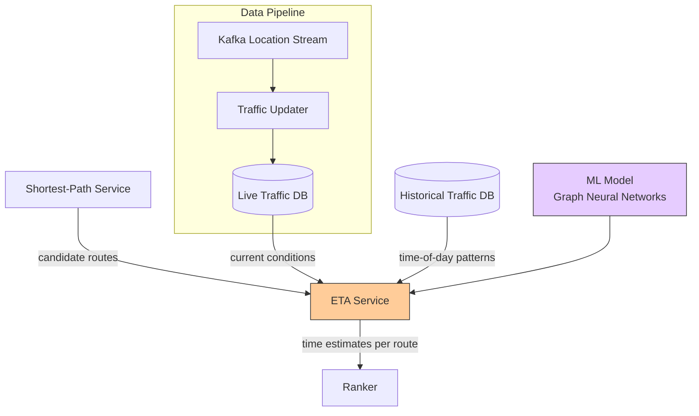

## Summary

The ETA (Estimated Time of Arrival) service uses machine learning to predict travel time along routes. It takes the candidate routes from the shortest-path service and current traffic data as inputs, producing time estimates that account for real-time conditions and predicted future traffic (10-20 minutes ahead). The live traffic database is continuously updated from Kafka location streams. Accurate ETA requires combining historical patterns, current conditions, and predictive modeling.

## How It Works

### Prediction Challenges

1. **Current traffic:** What are conditions right now on each road segment?
2. **Future traffic:** How will conditions change in 10-20 minutes as the user travels?
3. **Historical patterns:** What does traffic typically look like at this time of day/week?
4. **Incidents:** Accidents, construction, weather affecting travel time

### ML Approaches

- **Graph Neural Networks (GNNs):** Model road networks as graphs; predict travel times on edges based on neighboring edges and temporal features
- **Recurrent models:** Capture temporal patterns in traffic flow
- **Ensemble methods:** Combine multiple signals (speed, density, historical) for robust estimates

### Adaptive ETA

During active navigation:
1. Server tracks user's current routing tiles
2. When traffic conditions change on any tile, affected users are identified
3. ETA is recalculated and pushed via WebSocket
4. If a significantly faster route exists, rerouting is suggested

## When to Use

- Navigation applications requiring accurate arrival time estimates
- Ride-sharing platforms for pickup/delivery time predictions
- Logistics and delivery routing optimization
- Any application where traffic-aware time estimates improve user experience

## Trade-offs

| Benefit | Cost |
|---------|------|
| More accurate than static distance/speed estimates | Requires ML infrastructure and training pipeline |
| Adapts to real-time traffic conditions | Dependent on quality of location data streams |
| Predicts future traffic, not just current | Prediction accuracy degrades beyond ~30 min |
| Improves continuously with more data | Cold start problem in new areas with little data |
| Enables adaptive rerouting | Must track all active navigation sessions |

## Real-World Examples

- **Google Maps** -- ETA with Graph Neural Networks (DeepMind collaboration)
- **Waze** -- Community-driven traffic data for ETA
- **Uber** -- ML-based ETA for ride arrival estimates
- **Amazon** -- Delivery time prediction using traffic models

## Common Pitfalls

- Assuming static speed limits are sufficient for ETA (traffic changes everything)
- Not predicting future traffic (current conditions may not reflect the user's path in 20 min)
- Using only historical averages without real-time data (misses incidents and unusual conditions)
- Not feeding location streams back into the model (data flywheel improves accuracy over time)
- Pushing ETA updates via mobile push notifications (too limited; use WebSocket)

## See Also

- [[navigation-service]] -- The orchestrator that calls the ETA service
- [[location-service]] -- Provides the location data streams that feed traffic analysis
- [[routing-tiles]] -- The road graph on which ETA predictions are made
