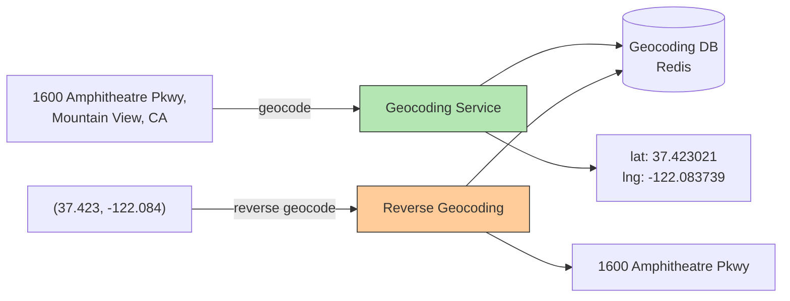

## Summary

Geocoding converts human-readable addresses (e.g., "1600 Amphitheatre Parkway, Mountain View, CA") into geographic coordinates (lat: 37.423021, lng: -122.083739). Reverse geocoding does the inverse -- converting coordinates back to addresses. Geocoding is implemented via interpolation on Geographic Information System (GIS) data, where the street network is mapped to coordinate space. The geocoding database is stored in a key-value store (Redis) for fast reads with infrequent writes, serving as the essential first step in the navigation pipeline.

## How It Works

### Geocoding Process

1. Parse the input address into components (street, city, state, country)
2. Look up in GIS data where the street network is mapped to coordinates
3. Use **interpolation** to estimate the exact position along a street segment
4. Return the lat/lng pair

### Data Storage

- **Key-value store (Redis):** Place name/address as key, lat/lng as value
- **Read-heavy, write-rare:** Addresses don't change often
- **Preloaded:** Geocoding data is loaded from GIS datasets

### Role in Navigation

Geocoding is the **first step** in route planning:
1. User enters origin and destination as text addresses
2. Geocoding service converts both to lat/lng pairs
3. Route planner uses the coordinates to find paths on routing tiles

## When to Use

- Navigation applications (converting user input to coordinates)
- Location search (matching text queries to geographic positions)
- Data enrichment (adding coordinates to address datasets)
- Delivery logistics (converting delivery addresses to routable coordinates)

## Trade-offs

| Benefit | Cost |
|---------|------|
| Enables text-based location input | Address formats vary globally |
| Redis provides sub-ms lookups | GIS data requires regular updates |
| Interpolation handles exact street addresses | Ambiguous addresses may return wrong results |
| Reverse geocoding enables "what's here?" features | Multiple addresses can map to similar coordinates |
| Cacheable (addresses rarely change) | Street renaming/new construction requires updates |

## Real-World Examples

- **Google Geocoding API** -- Enterprise geocoding service
- **OpenCage** -- Open-source geocoding using OpenStreetMap data
- **Mapbox Geocoding** -- Forward and reverse geocoding API
- **Nominatim** -- Free geocoder using OpenStreetMap data
- **HERE Geocoder** -- Automotive and enterprise geocoding

## Common Pitfalls

- Not caching geocoding results (same addresses are queried repeatedly)
- Assuming all countries use the same address format (they don't)
- Using geocoding for real-time, high-QPS workloads without a cache layer
- Not handling ambiguous addresses (multiple possible matches)
- Confusing geocoding with geohashing (geocoding converts addresses; geohashing encodes coordinates)

## See Also

- [[navigation-service]] -- Calls geocoding as the first step in route planning
- [[map-tiling]] -- Uses coordinates (from geocoding) to determine which tiles to display
- [[routing-tiles]] -- Consumes the lat/lng output of geocoding for pathfinding
