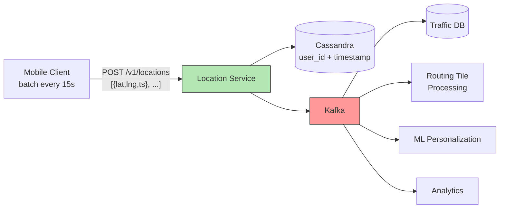

## Summary

The location service ingests GPS updates from 1B DAU during navigation sessions. Clients batch updates every 15 seconds (reducing QPS from 3M to 200K average, 1M peak). Data is written to Cassandra (partitioned by user_id, clustered by timestamp) and streamed through Kafka. Kafka decouples the location ingestion from multiple downstream consumers: live traffic DB, routing tile processing (new/closed road detection), ML personalization, and analytics.

## How It Works

### Client Batching

- GPS recorded every second on the client
- Batched and sent to server every 15 seconds
- Reduces QPS by 15x compared to per-second sends
- Batch frequency can adapt (slower in traffic, faster on highways)

### Cassandra Schema

| Column | Role |
|---|---|
| `user_id` | Partition key (even data distribution) |
| `timestamp` | Clustering key (sorted within partition) |
| `lat, lng` | Location coordinates |
| `user_mode` | Walking, driving, etc. |

Efficient range queries: "give me User X's locations between time A and B"

### Kafka Consumers

1. **Traffic DB updater** -- Extracts live traffic conditions from location streams
2. **Routing tile processing** -- Detects new or closed roads, updates routing tiles
3. **ML service** -- Builds personalization models from travel patterns
4. **Analytics** -- Aggregates usage data for reporting

## When to Use

- High-volume write workloads (hundreds of thousands of writes/sec)
- When location data must feed multiple downstream services
- When data replay and stream processing are needed
- When write availability is more important than strong consistency

## Trade-offs

| Benefit | Cost |
|---------|------|
| Client batching reduces QPS 15x | Slightly delayed location data (up to 15s) |
| Cassandra handles massive write throughput | Eventual consistency for reads |
| Kafka decouples ingestion from consumers | Additional infrastructure complexity |
| Multiple consumers process data independently | Consumer lag can delay downstream updates |
| Cassandra partitioning enables efficient range queries | Requires careful partition key design |

## Real-World Examples

- **Google Maps** -- Location data pipeline feeding traffic and map quality
- **Uber** -- Kafka-based location streaming for driver tracking
- **Waze** -- Community GPS data improving traffic estimates
- **Strava** -- GPS activity tracking with stream processing

## Common Pitfalls

- Sending GPS updates every second from the client (excessive QPS and battery drain)
- Using a relational database for high-volume location writes (Cassandra handles this better)
- Directly coupling location ingestion to traffic/routing processing (use Kafka for decoupling)
- Not choosing user_id as Cassandra partition key (causes hotspots with geographic partitioning)
- Ignoring battery and data usage on mobile clients (batching is essential)

## See Also

- [[navigation-service]] -- Consumes traffic data derived from location streams
- [[eta-service]] -- Uses live traffic data for accurate predictions
- [[routing-tiles]] -- Updated by routing tile processing from location streams
