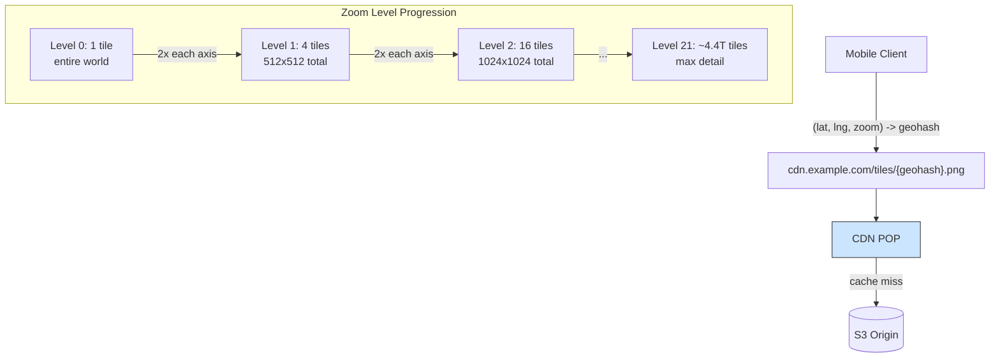

## Summary

Map tiling breaks the world map into small 256x256 pixel images at 21 discrete zoom levels. At zoom level 0, one tile covers the entire world. Each subsequent level doubles tiles in both axes (4x total), providing progressively more detail. Tiles are pre-generated, static PNGs identified by geohash, making them ideal for CDN caching. The total storage is approximately 100 PB across all zoom levels. Vector tiles (WebGL) offer better compression and smoother zooming than raster tiles.

## How It Works

1. World is divided into tiles using a geohash-like subdivision scheme
2. At each zoom level, tiles are **pre-rendered** as 256x256 PNG images
3. Client determines needed tiles from `(lat, lng, zoom_level)`
4. Client computes geohash to construct tile URL
5. Tiles fetched from nearest CDN POP (cache hit) or origin (cache miss)

### Zoom Level Math

| Level | Tiles | Coverage per Tile |
|---|---|---|
| 0 | 1 | Entire world |
| 1 | 4 | Hemisphere quadrant |
| 10 | ~1M | ~150 km x 150 km |
| 15 | ~1B | ~4.9 km x 4.9 km |
| 21 | ~4.4T | ~20 m x 20 m |

### Vector Tiles vs Raster Tiles

- **Raster:** Pre-rendered PNG images; simple but large
- **Vector:** Paths and polygons; client renders via WebGL; better compression, smooth zoom transitions

## When to Use

- Any map rendering application (navigation, location search, GIS)
- When serving maps to millions of users globally
- When bandwidth conservation matters (mobile devices)
- When smooth zoom/pan experience is required

## Trade-offs

| Benefit | Cost |
|---------|------|
| Highly cacheable (static content) | Massive storage (~100 PB all levels) |
| CDN-friendly, low latency delivery | Pre-generation requires significant compute |
| Client computes tile URL (no server round-trip) | Hardcoded algorithm on client is hard to change |
| Discrete zoom levels reduce tile count | Zoom transitions can be jarring with raster tiles |
| 90% compression for uninhabited areas | Still need to store tiles for every zoom level |

## Real-World Examples

- **Google Maps** -- 21 zoom levels with vector tiles (WebGL)
- **OpenStreetMap** -- Raster tile servers with community-contributed data
- **Mapbox** -- Vector tile service with custom styling
- **Apple Maps** -- Vector tiles with 3D rendering

## Common Pitfalls

- Generating tiles on-the-fly instead of pre-rendering (huge server load, no caching)
- Not using a CDN for tile delivery (every request hits origin)
- Downloading high-zoom tiles when the user is zoomed out (wastes bandwidth)
- Hardcoding tile URL computation on the client without a service fallback (hard to change algorithms later)
- Not compressing tiles for uninhabited areas (oceans, deserts) -- 90% savings possible

## See Also

- [[cdn-map-delivery]] -- CDN strategy for serving tiles globally
- [[routing-tiles]] -- Similar tiling concept applied to road graph data
- [[geocoding]] -- Converting addresses to coordinates for tile lookups
