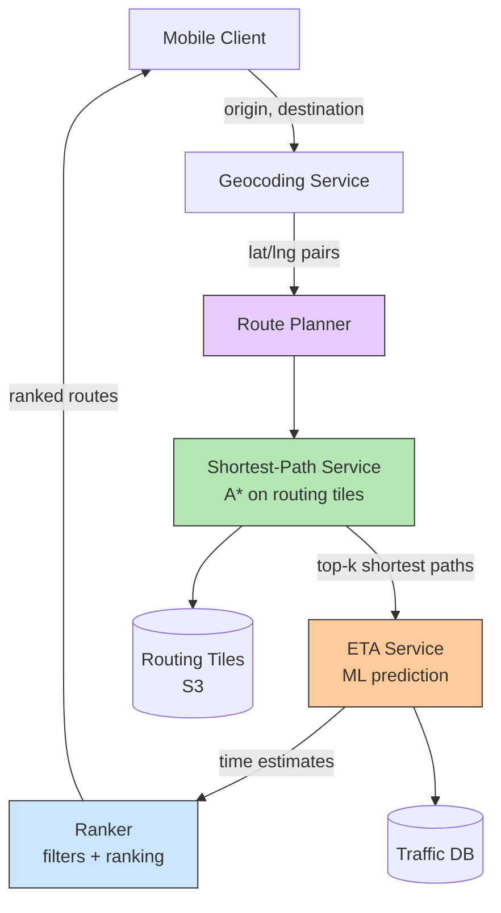

## Summary

The navigation service finds reasonably fast routes between origin and destination. It orchestrates three sub-services: the shortest-path service (A* on routing tiles), the ETA service (ML-based traffic prediction), and the ranker (applies user filters like avoid tolls/freeways and ranks by travel time). Geocoding converts addresses to lat/lng pairs before routing begins. Adaptive ETA tracks actively navigating users and pushes rerouting updates via WebSocket when traffic conditions change.

## How It Works

### Request Flow

1. Client sends `GET /v1/nav?origin=...&destination=...`
2. **Geocoding** converts addresses to lat/lng pairs
3. **Shortest-path service** runs A* on routing tiles, returns top-k routes
4. **ETA service** predicts travel time for each route using current + predicted traffic
5. **Ranker** applies user preferences (avoid tolls, prefer highways) and ranks routes
6. Top results returned to client with distance, duration, and turn-by-turn directions

### Adaptive ETA and Rerouting

- Server tracks actively navigating users and their routing tiles
- When traffic changes in a routing tile, affected users are identified
- Hierarchical tile lookup quickly filters unaffected users
- New ETA and alternate routes pushed via **WebSocket**

## When to Use

- Navigation applications with real-time traffic awareness
- Systems requiring multi-criteria route optimization (time, distance, preferences)
- Applications where route accuracy is critical (wrong directions are unacceptable)
- Services needing adaptive rerouting during active navigation

## Trade-offs

| Benefit | Cost |
|---------|------|
| Separation of shortest-path, ETA, and ranking | Multiple service calls add latency |
| ML-based ETA is more accurate than static estimates | Requires training data and model infrastructure |
| Adaptive rerouting improves user experience | Must track all active navigation sessions |
| Hierarchical tile lookup for affected users is efficient | Complex data structure for user-to-tile mapping |
| Caching shortest paths (graph rarely changes) | Cache invalidation when roads change |

## Real-World Examples

- **Google Maps** -- Navigation with real-time traffic, ETA, and rerouting
- **Waze** -- Community-driven traffic data feeding navigation
- **Apple Maps** -- Turn-by-turn navigation with traffic-aware ETA
- **HERE Maps** -- Automotive navigation platform

## Common Pitfalls

- Trying to find the globally optimal route (good enough is acceptable; accuracy matters more)
- Not separating shortest-path from ETA (different concerns, different update frequencies)
- Using only static road data without live traffic (ETAs will be inaccurate)
- Not caching geocoding results (same addresses queried repeatedly)
- Sending rerouting updates via push notifications (payload too small; use WebSocket)

## See Also

- [[routing-tiles]] -- The graph data consumed by the shortest-path service
- [[eta-service]] -- ML-based travel time prediction
- [[geocoding]] -- Address-to-coordinate conversion
- [[location-service]] -- Feeds traffic data that improves ETA accuracy
