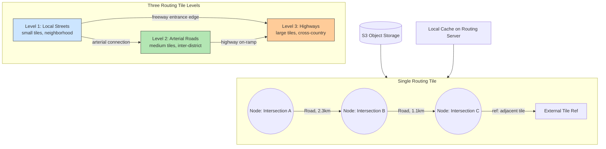

## Summary

Routing tiles partition the world's road network into small graph data structures stored in object storage (S3). Each tile contains nodes (intersections) and edges (roads) as adjacency lists, plus references to connecting tiles. Three levels of detail exist: local streets (small tiles), arterial roads (medium tiles), and highways (large tiles). Cross-level edges link, for example, a freeway entrance in a local tile to the highway in a larger tile. Pathfinding algorithms (A*) load tiles on demand, keeping memory consumption manageable.

## How It Works

### How A* Uses Routing Tiles

1. Convert origin and destination to geohashes to locate start/end tiles
2. Load the origin routing tile from S3 (or local cache)
3. Expand graph traversal into neighboring tiles on demand
4. When the algorithm encounters a cross-level edge (e.g., freeway entrance), load the higher-level tile
5. Continue expanding until optimal routes are found
6. Cache frequently accessed tiles locally for subsequent queries

### Storage Format

- Tiles are serialized adjacency lists stored as binary files in S3
- Organized by geohash for fast lookup by lat/lng pair
- Updated periodically by the routing tile processing service (detects new/closed roads)

## When to Use

- Any navigation system operating at continental or global scale
- When the full road graph is too large to fit in memory
- When different routing needs require different levels of detail
- When road data changes over time and must be updated incrementally

## Trade-offs

| Benefit | Cost |
|---------|------|
| Memory-efficient (load on demand) | Latency on cache miss (S3 fetch) |
| Three levels optimize for trip length | Complex cross-level edge management |
| S3 storage is cheap and durable | Requires periodic reprocessing pipeline |
| Geohash-based organization enables fast lookup | Road changes take time to propagate |
| Incremental loading reduces memory from TB to MB | More complex than single in-memory graph |

## Real-World Examples

- **Google Maps** -- Hierarchical routing tiles for global navigation
- **Valhalla (Mapzen/Mapbox)** -- Open-source routing engine using tiled road graphs
- **HERE Maps** -- Routing tiles for automotive navigation
- **OSRM** -- Open Source Routing Machine with contraction hierarchies (similar concept)

## Common Pitfalls

- Trying to load the entire world's road graph into memory (terabytes of data)
- Using only one level of routing tiles (cross-country queries traverse too many small tiles)
- Not caching frequently accessed tiles on routing servers (repeated S3 fetches)
- Storing routing tiles in a relational database (overhead without benefit; S3 + binary format is simpler)
- Not updating routing tiles when roads change (stale graphs give wrong directions)

## See Also

- [[navigation-service]] -- The service architecture that consumes routing tiles
- [[map-tiling]] -- Same tiling concept applied to visual map rendering
- [[eta-service]] -- Uses routing results to estimate travel times
