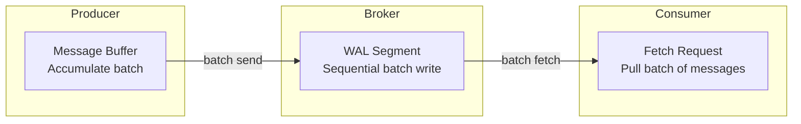

## Summary

**Batching** is applied at every level of the message queue -- producer, broker, and consumer -- to amortize per-request overhead (network round trips, disk seeks, system calls). Larger batches yield higher throughput but increase end-to-end latency. Combined with sequential disk I/O, OS page cache, and zero-copy transfers, batching is the primary lever for achieving high throughput in distributed message queues.

## How It Works

1. **Producer batching**: messages are buffered in memory and sent in bulk when a size or time threshold is reached
2. **Broker batching**: incoming batches are written sequentially to WAL segments, maximizing disk throughput
3. **Consumer batching**: fetch requests pull multiple messages at once, reducing network round trips
4. **OS page cache**: recently written data is served from memory for consumer reads
5. **Zero-copy**: data goes directly from page cache to network socket, avoiding user-space copies

## When to Use

- High-throughput streaming workloads (log aggregation, event sourcing, analytics)
- Scenarios where small I/O would otherwise bottleneck the system
- When end-to-end latency of a few hundred milliseconds is acceptable
- Any message queue deployment aiming for > 100K messages/sec

## Trade-offs

| Aspect | Benefit | Cost |
|---|---|---|
| Large batch size | Higher throughput, better disk utilization | Higher end-to-end latency |
| Small batch size | Lower latency per message | Lower throughput, more I/O overhead |
| Producer buffering | Fewer network requests | Risk of data loss if producer crashes before send |
| Consumer large fetch | Fewer fetch requests, better throughput | Higher memory usage at consumer |
| Zero-copy transfer | Eliminates CPU copy overhead | Requires OS support, less flexible for transformation |

## Real-World Examples

- **Apache Kafka**: `batch.size` and `linger.ms` control producer batching; `fetch.min.bytes` and `fetch.max.wait.ms` for consumers
- **Amazon Kinesis**: `PutRecords` API sends up to 500 records per batch
- **Apache Pulsar**: client-side batching with configurable max messages and max delay
- **RabbitMQ**: publisher confirms can be batched; consumers prefetch configurable count

## Common Pitfalls

- Setting `linger.ms=0` and expecting high throughput (sends every message individually)
- Not tuning `fetch.min.bytes` on consumers (fetching one message at a time wastes bandwidth)
- Ignoring the latency impact of large batches in latency-sensitive use cases
- Forgetting that producer buffer memory is bounded -- too many in-flight batches can cause back-pressure

## See Also

- [[topics-partitions-brokers]] -- partitions are the parallelism unit; batching happens per partition
- [[write-ahead-log]] -- sequential writes to WAL benefit most from batching
- [[replication-isr]] -- replication also benefits from batching follower fetch requests
