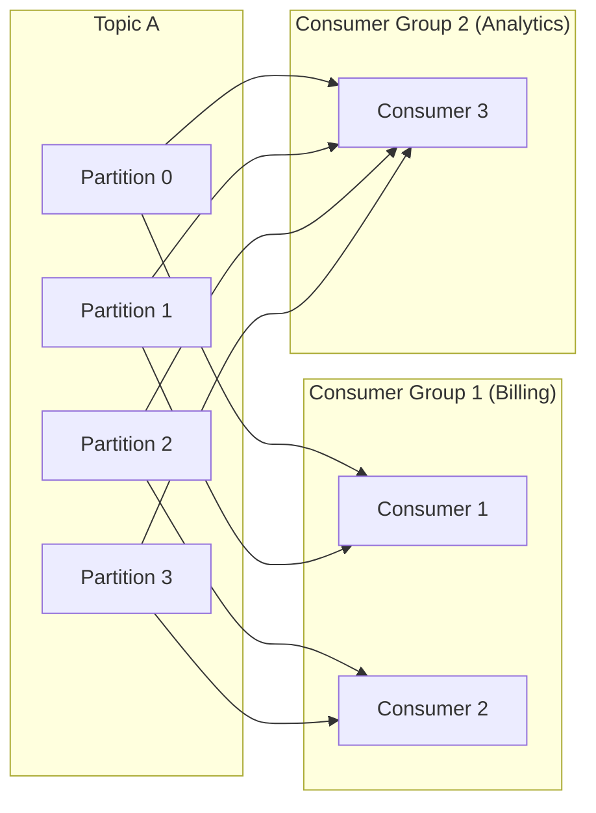

## Summary

A **consumer group** is a set of consumers that collectively consume messages from one or more topics. Each partition within a topic is assigned to exactly one consumer in the group, enabling parallel processing while preserving per-partition message ordering. Multiple consumer groups can independently consume the same topic, supporting the publish-subscribe model. When all consumers are in one group, the system behaves as a point-to-point queue.

## How It Works

1. Each consumer group subscribes to one or more topics
2. Partitions are distributed among consumers in the group (each partition to exactly one consumer)
3. Each group maintains its own **consumed offset** per partition
4. If consumers < partitions, some consumers handle multiple partitions
5. If consumers > partitions, excess consumers sit idle (no work assigned)
6. Different groups consume independently -- same message delivered to each group

## When to Use

- Multiple teams or services need to independently process the same event stream
- You need parallel consumption of a topic while maintaining per-partition ordering
- Switching between point-to-point (one group) and pub-sub (multiple groups) patterns
- Scaling consumer throughput by adding consumers within a group

## Trade-offs

| Aspect | Benefit | Cost |
|---|---|---|
| One consumer per partition | Guaranteed ordering within partition | Max parallelism limited by partition count |
| Multiple groups | Independent consumption of same data | Each group stores its own offsets |
| Few consumers in group | Simple coordination | Lower throughput |
| Many consumers in group | Higher throughput | More frequent rebalancing on changes |

## Real-World Examples

- **Kafka Consumer Groups**: core feature since Kafka 0.9, managed by group coordinator
- **Amazon Kinesis**: applications act as consumer groups using KCL (Kinesis Client Library)
- **RabbitMQ**: competing consumers on a queue (point-to-point); exchanges for pub-sub
- **Google Pub/Sub**: subscriptions serve as the consumer group equivalent

## Common Pitfalls

- Adding more consumers than partitions (excess consumers sit idle)
- Not accounting for rebalancing downtime when consumers join or leave
- Mixing fast and slow consumers in the same group (slow consumer blocks its partitions)
- Forgetting that ordering is only guaranteed within a partition, not across them

## See Also

- [[topics-partitions-brokers]] -- the data model consumers read from
- [[consumer-rebalancing]] -- what happens when group membership changes
- [[delivery-semantics]] -- how offset management affects delivery guarantees
