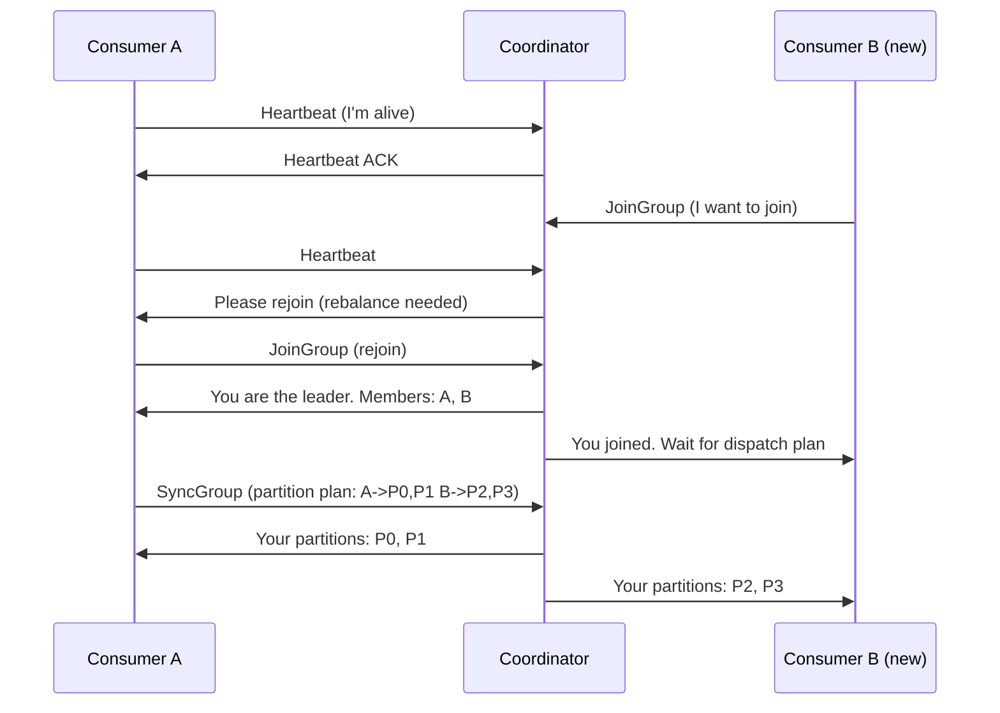

## Summary

**Consumer rebalancing** is the process of redistributing partition assignments among consumers in a group when membership changes. Triggered by a consumer joining, leaving, or crashing, the coordinator broker orchestrates the rebalance using heartbeat, JoinGroup, and SyncGroup protocols. A leader consumer generates the new partition dispatch plan, and all consumers receive their updated assignments.

## How It Works

1. Consumers send periodic **heartbeats** to the coordinator
2. When membership changes, the coordinator notifies existing consumers to rejoin
3. All consumers send **JoinGroup** requests; coordinator selects a **leader**
4. The leader consumer generates a partition dispatch plan
5. The leader sends the plan via **SyncGroup**; coordinator distributes assignments
6. Consumers start consuming from their newly assigned partitions
7. If a consumer crashes (no heartbeat), the coordinator marks it dead and triggers rebalance

## When to Use

- Anytime consumer group membership is dynamic (auto-scaling, rolling deploys)
- When a consumer crashes and its partitions need reassignment
- When partitions are added to a topic and need to be distributed to consumers
- During planned maintenance when consumers are gracefully shut down

## Trade-offs

| Aspect | Benefit | Cost |
|---|---|---|
| Automatic rebalancing | Self-healing on failure | Brief processing pause during rebalance |
| Heartbeat-based detection | Catches crashed consumers | Too-short heartbeat interval = false positives |
| Leader-based dispatch | Flexible partition strategies | Single point of plan generation |
| Eager rebalancing | Simple implementation | All partitions revoked, then reassigned (stop-the-world) |
| Incremental rebalancing | Only affected partitions move | More complex protocol |

## Real-World Examples

- **Apache Kafka**: group coordinator + consumer leader protocol (KIP-429 for incremental rebalancing)
- **Amazon Kinesis**: KCL (Kinesis Client Library) uses lease-based assignment with DynamoDB
- **Apache Pulsar**: topic-level assignment via broker-side load manager
- **RabbitMQ**: consumer prefetch and exclusive queues (no partition rebalancing needed)

## Common Pitfalls

- Setting heartbeat timeout too low, causing unnecessary rebalances from GC pauses
- Not handling `onPartitionsRevoked` callback -- leads to duplicate processing
- Slow consumers blocking rebalance completion for the entire group
- Running too many rebalances during rolling deployments (use session timeout tuning)

## See Also

- [[consumer-groups]] -- the group that triggers rebalancing
- [[topics-partitions-brokers]] -- the partitions being reassigned
- [[delivery-semantics]] -- rebalancing can cause duplicate consumption in at-least-once mode
