## Summary

Distributed message queues support three delivery semantics: **at-most-once** (messages may be lost but never duplicated), **at-least-once** (messages are never lost but may be duplicated), and **exactly-once** (each message delivered exactly once). The choice involves coordinating producer ACK settings, consumer offset commit strategies, and optionally idempotent/transactional features. Most systems default to at-least-once and handle deduplication at the consumer.

## How It Works

```mermaid
graph TD
    subgraph AtMost["At-Most Once"]
        P1[Producer ACK=0] -->|may lose| Q1[Queue]
        Q1 -->|commit before process| C1[Consumer]
    end

    subgraph AtLeast["At-Least Once"]
        P2["Producer ACK=1/all + retry"] -->|guaranteed delivery| Q2[Queue]
        Q2 -->|commit after process| C2[Consumer]
    end

    subgraph Exactly["Exactly Once"]
        P3["Idempotent Producer"] -->|deduped writes| Q3[Queue]
        Q3 -->|transactional commit| C3[Consumer]
    end
```

**At-most once:**
1. Producer sends asynchronously (ACK=0), no retries
2. Consumer commits offset **before** processing
3. If consumer crashes after commit but before processing, message is skipped

**At-least once:**
1. Producer sends with ACK=1 or ACK=all, retries on failure
2. Consumer commits offset **after** successful processing
3. If consumer crashes after processing but before commit, message is reprocessed

**Exactly once:**
1. Producer uses idempotent writes (sequence numbers to deduplicate retries)
2. Consumer uses transactional offset commits
3. End-to-end: requires producer idempotency + consumer-side transactional processing

## When to Use

| Semantic | Best For | Examples |
|---|---|---|
| At-most once | Metrics collection, logging where occasional loss is OK | CPU monitoring, click tracking |
| At-least once | Most applications; deduplication at consumer is feasible | Order processing, log aggregation |
| Exactly once | Financial transactions, billing, anything where duplicates cause harm | Payments, trading, accounting |

## Trade-offs

| Aspect | Benefit | Cost |
|---|---|---|
| At-most once | Lowest latency, simplest | Data loss possible |
| At-least once | No data loss | Duplicates require consumer-side handling |
| Exactly once | Clean semantics for users | Higher latency, complexity, and resource usage |
| Idempotent producer | Prevents duplicate sends on retry | Sequence tracking overhead per partition |
| Transactional commits | Atomic offset + processing | Cross-partition coordination overhead |

## Real-World Examples

- **Apache Kafka**: supports all three; exactly-once via idempotent producer + transactions (KIP-98)
- **Amazon SQS**: at-least-once by default; FIFO queues offer exactly-once
- **RabbitMQ**: at-most-once default; publisher confirms for at-least-once
- **Google Pub/Sub**: at-least-once; exactly-once via Dataflow integration

## Common Pitfalls

- Assuming the message queue alone provides exactly-once (consumer must also be idempotent)
- Committing offsets before processing in at-least-once mode (silently drops messages)
- Not implementing deduplication when using at-least-once (leads to double-processing)
- Using exactly-once everywhere regardless of need (unnecessary performance cost)

## See Also

- [[replication-isr]] -- ACK levels are the producer side of delivery guarantees
- [[consumer-groups]] -- offset management determines consumer-side semantics
- [[consumer-rebalancing]] -- rebalancing can cause re-delivery in at-least-once mode
