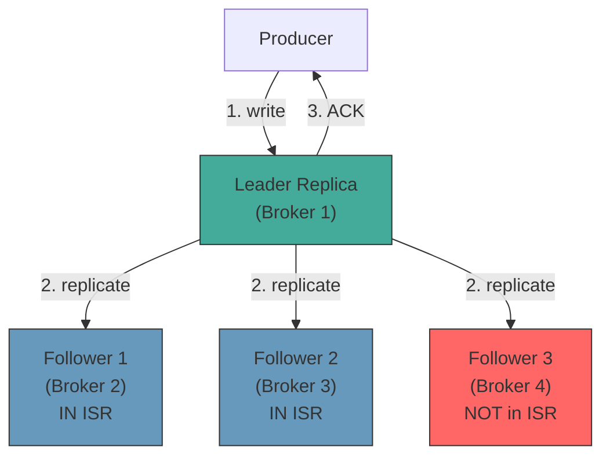

## Summary

Each partition is replicated across multiple brokers for fault tolerance. One replica is the **leader** (handles all reads and writes) and the others are **followers** that continuously pull data from the leader. The set of replicas that are fully caught up is called the **in-sync replica set (ISR)**. Producers choose an ACK level (0, 1, or all) to control how many ISRs must persist a message before it is considered committed, trading durability for latency.

## How It Works

1. Producers write only to the **leader replica** of a partition
2. Followers continuously **fetch** new messages from the leader
3. A follower is in the ISR if it is behind the leader by no more than `replica.lag.max.messages`
4. The **committed offset** advances when all ISRs have replicated the message
5. Consumers only read up to the committed offset
6. If the leader fails, a new leader is elected from the ISR

**ACK modes:**
- **ACK=0**: producer sends without waiting -- lowest latency, may lose messages
- **ACK=1**: leader persists before ACK -- medium latency, leader failure loses uncommitted data
- **ACK=all**: all ISRs persist before ACK -- highest latency, strongest durability

## When to Use

- Any distributed system where data loss from a single node failure is unacceptable
- Streaming platforms that need configurable durability guarantees
- Systems where consumers must never read uncommitted (partially replicated) data
- Multi-datacenter deployments requiring strong consistency within a region

## Trade-offs

| Aspect | Benefit | Cost |
|---|---|---|
| ACK=all | No data loss on single failure | Higher write latency (wait for slowest ISR) |
| ACK=1 | Lower latency | Risk of data loss if leader fails before replication |
| ACK=0 | Lowest latency | May lose messages silently |
| More replicas | Tolerates more simultaneous failures | More disk, network, and coordination overhead |
| Fewer replicas | Lower resource cost | Less fault tolerance |
| Strict ISR | Strong consistency | A slow follower can cause ISR to shrink, reducing fault tolerance |

## Real-World Examples

- **Apache Kafka**: ISR-based replication with configurable `min.insync.replicas`
- **Apache Pulsar**: managed ledger replication with write quorum and ack quorum
- **Amazon Kinesis**: synchronous replication across 3 AZs (always ACK=all equivalent)
- **etcd/Raft**: leader-based replication with quorum writes (similar ISR concept)

## Common Pitfalls

- Setting `min.insync.replicas=1` with ACK=all (provides no replication guarantee at all)
- Placing all replicas on the same broker (defeats the purpose of replication)
- Not monitoring ISR shrinkage -- a shrinking ISR signals replication lag or broker issues
- Ignoring the trade-off: ACK=all with many replicas across data centers causes high latency

## See Also

- [[topics-partitions-brokers]] -- replicas are per-partition, distributed across brokers
- [[write-ahead-log]] -- the data that gets replicated
- [[delivery-semantics]] -- ACK levels determine delivery guarantees
