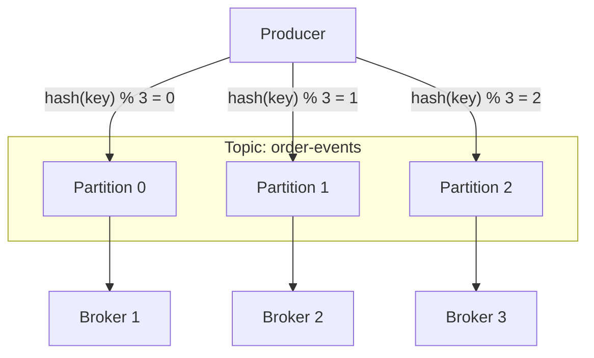

## Summary

In a distributed message queue, messages are organized into **topics** (named categories). Each topic is divided into **partitions** -- independent, ordered logs that are distributed across cluster nodes called **brokers**. This partitioning scheme is the primary mechanism for horizontal scalability: more partitions mean more parallelism for both writes and reads.

## How It Works

1. A **topic** is created with a configurable number of partitions
2. Each partition is an append-only log with monotonically increasing **offsets**
3. A message key determines partition assignment via `hash(key) % num_partitions`
4. If no key is specified, messages are distributed round-robin
5. Partitions are spread across broker nodes for load distribution
6. Each broker hosts multiple partitions from different topics

## When to Use

- Streaming platforms where high throughput and ordering are both required
- Event-driven architectures with multiple consumers needing independent read positions
- Log aggregation systems that need to scale write capacity horizontally
- Any system where data volume for a single topic exceeds one server's capacity

## Trade-offs

| Aspect | Benefit | Cost |
|---|---|---|
| More partitions | Higher throughput and parallelism | More metadata overhead, longer rebalancing |
| Fewer partitions | Simpler management, faster rebalance | Limited parallelism |
| Key-based routing | Guarantees ordering per key | Risk of hot partitions if key distribution is skewed |
| Round-robin routing | Even distribution | No ordering guarantee across partitions |

## Real-World Examples

- **Apache Kafka**: topics with configurable partitions across broker cluster
- **Apache Pulsar**: topics with partitions managed by BookKeeper
- **Amazon Kinesis**: streams (topics) divided into shards (partitions)
- **Google Pub/Sub**: topics with ordered keys for partition-like behavior

## Common Pitfalls

- Starting with too few partitions and needing to repartition (causes data redistribution)
- Choosing a message key with high cardinality variation, creating hot partitions
- Confusing message ordering across partitions (only per-partition ordering is guaranteed)
- Placing all replicas of a partition on the same broker, eliminating fault tolerance

## See Also

- [[consumer-groups]] -- how consumers parallelize reads across partitions
- [[write-ahead-log]] -- how partitions store data on disk
- [[replication-isr]] -- how partitions are replicated for durability
- [[batching-and-throughput]] -- how batching interacts with partition writes
