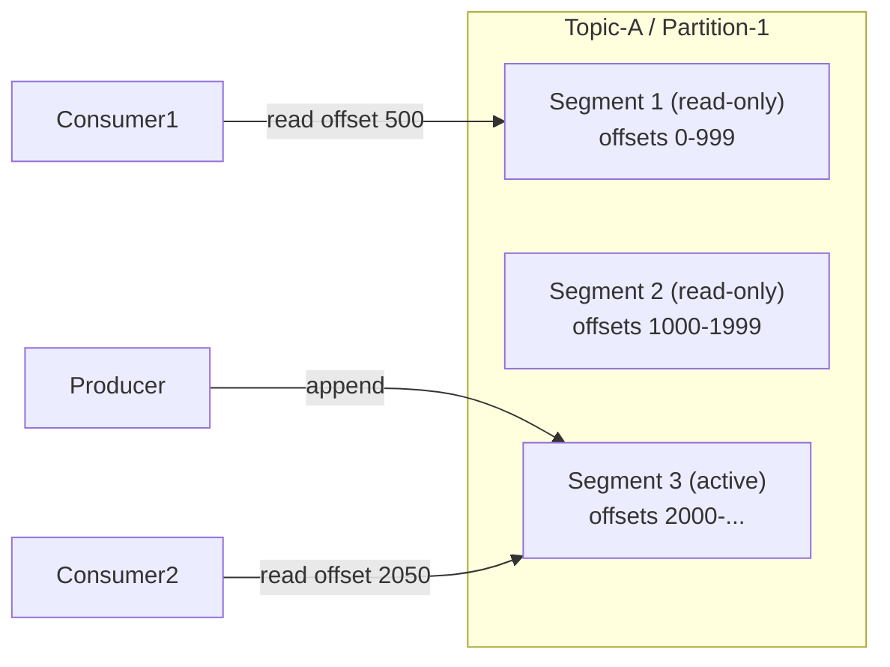

## Summary

In a distributed message queue, each partition's messages are persisted as an **append-only write-ahead log (WAL)** on disk. New messages are always appended to the end of the active segment file. When a segment reaches its size limit, it becomes read-only and a new active segment takes over. This design leverages **sequential disk I/O**, which is dramatically faster than random access, and benefits heavily from operating system page cache.

## How It Works

1. Each partition is a directory containing ordered **segment files**
2. New messages are **appended** to the tail of the active segment with a monotonically increasing offset
3. When the active segment reaches a size threshold, it is sealed and a new one is created
4. Consumers read from any offset by locating the correct segment file
5. Old segments are **truncated** when they exceed the retention period or capacity limit
6. The OS aggressively caches segment files in memory (page cache), serving most reads from RAM

## When to Use

- High-throughput message persistence where sequential I/O patterns dominate
- Systems that need offset-based replay (consumers can rewind to any position)
- Workloads that are write-heavy with no updates or deletes to existing data
- Scenarios requiring both durability and high performance on commodity hardware

## Trade-offs

| Aspect | Benefit | Cost |
|---|---|---|
| Append-only writes | Extremely fast sequential I/O (hundreds of MB/s) | No in-place updates or deletes |
| Segment files | Manageable file sizes, easy retention cleanup | Need offset-to-segment index |
| OS page cache | Hot data served from memory automatically | Memory shared with other processes |
| Rotational disks | Cheap, large capacity for retention | Slower random access (not an issue here) |
| SSD | Faster reads for cold segments | Higher cost per TB |

## Real-World Examples

- **Apache Kafka**: each partition is a commit log of segment files on disk
- **Apache Pulsar**: uses Apache BookKeeper for distributed log segments
- **MySQL InnoDB**: redo log uses WAL for crash recovery
- **PostgreSQL**: WAL for write-ahead logging and replication
- **Apache ZooKeeper**: transaction log for consensus

## Common Pitfalls

- Using a database (SQL/NoSQL) instead of WAL for message storage -- adds unnecessary overhead for this access pattern
- Not configuring segment size properly (too small = too many files; too large = slow cleanup)
- Ignoring disk throughput when planning capacity (sequential throughput, not IOPS, is the bottleneck)
- Not monitoring disk usage for retention -- unbounded growth can fill disks

## See Also

- [[topics-partitions-brokers]] -- partitions are the logical unit that WAL stores
- [[batching-and-throughput]] -- batching maximizes sequential write efficiency
- [[replication-isr]] -- WAL data is replicated for fault tolerance
