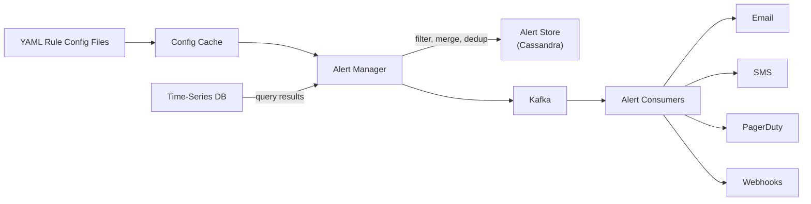

## Summary

The **alerting system** evaluates YAML-defined rules against time-series data at regular intervals. When a threshold is violated, it creates alert events that are filtered, merged, and deduplicated by an alert manager. Alert state (inactive, pending, firing, resolved) is stored in a KV store (e.g., Cassandra). Eligible alerts are pushed to Kafka and dispatched by alert consumers to email, SMS, PagerDuty, or webhook channels. The system ensures at-least-once notification delivery through retry logic.

## How It Works

1. Alert rules are defined in **YAML config files** and loaded into a cache
2. The alert manager **periodically queries** the time-series DB based on rule intervals
3. If a metric violates the threshold (e.g., `up == 0 for 5m`), an alert event is created
4. **Filter and merge**: multiple events for the same instance within a short window are merged
5. **Deduplication**: prevents sending the same alert repeatedly
6. Alert state is persisted in a **KV store** for durability and retry
7. Alerts are pushed to **Kafka** for reliable, asynchronous delivery
8. Alert consumers dispatch notifications to configured channels

## When to Use

- Infrastructure monitoring where critical failures must be immediately escalated
- SLA compliance monitoring with automated threshold-based notifications
- Multi-channel notification systems requiring reliable delivery
- Any monitoring system that needs to avoid alert fatigue through deduplication and merging

## Trade-offs

| Aspect | Benefit | Cost |
|---|---|---|
| YAML-based rules | Version-controllable, auditable, easy to review | Less flexible than programmatic rules |
| KV store for state | Durable, supports retry and state tracking | Additional storage system to manage |
| Kafka for dispatch | Reliable delivery, decoupled consumers | Operational overhead |
| Alert merging | Reduces alert fatigue | May delay individual alerts slightly |
| Build your own | Full customization | Significant engineering effort |
| Off-the-shelf (Grafana Alerts, PagerDuty) | Battle-tested, rich integrations | Less customization |

## Real-World Examples

- **Prometheus Alertmanager**: YAML rules, groups, silencing, inhibition, and multi-channel routing
- **Grafana Alerting**: unified alerting across data sources with contact point routing
- **PagerDuty**: incident management with escalation policies, dedup keys, and integrations
- **Amazon CloudWatch Alarms**: threshold and anomaly detection alarms with SNS integration
- **Datadog Monitors**: metric, log, and APM-based alerting with configurable channels

## Common Pitfalls

- Not deduplicating alerts -- the same issue triggers hundreds of notifications
- Missing the "for" duration in rules (e.g., `for: 5m`) -- transient spikes cause false alarms
- Not implementing alert silencing during planned maintenance
- Insufficient retry logic -- a single notification failure means a missed critical alert
- Alert fatigue from too-sensitive thresholds -- teams start ignoring alerts

## See Also

- [[time-series-database]] -- the data source queried by alert rules
- [[metrics-transmission-pipeline]] -- Kafka is reused for alert delivery
- [[downsampling-and-retention]] -- data resolution affects alert accuracy
