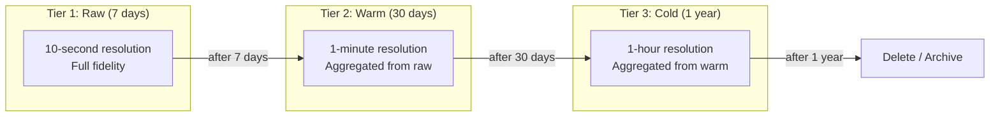

## Summary

**Downsampling** converts high-resolution time-series data to lower resolution over time, dramatically reducing storage requirements. A typical tiered retention policy keeps raw data for 7 days, 1-minute resolution for 30 days, and 1-hour resolution for 1 year -- yielding over 95% storage savings compared to keeping all raw data. Additional techniques include **double-delta encoding** (compressing timestamps to 4 bits instead of 32) and **cold storage** for rarely accessed historical data.

## How It Works

1. Metrics are ingested at **full resolution** (e.g., every 10 seconds)
2. After 7 days, data is **rolled up** to 1-minute aggregates (avg, min, max, count)
3. After 30 days, data is further rolled up to 1-hour aggregates
4. After 1 year, data is deleted or archived to **cold storage** (S3, Glacier)
5. **Double-delta encoding** compresses timestamps: instead of storing `1610087371, 1610087381`, store `base: 1610087371, deltas: 10, 10, 9, 11`
6. Queries automatically route to the appropriate resolution tier

## When to Use

- Any time-series system with long retention requirements (months to years)
- When storage costs need to be controlled for millions of metric series
- Systems where old data only needs coarse-grained resolution for trend analysis
- When regulatory or business requirements mandate long-term data retention

## Trade-offs

| Aspect | Benefit | Cost |
|---|---|---|
| Aggressive downsampling | Massive storage savings (>95%) | Loss of fine-grained detail for old data |
| Conservative downsampling | More data retained for analysis | Higher storage costs |
| Double-delta encoding | 4 bits per timestamp instead of 32 | Slightly more CPU for encoding/decoding |
| Cold storage (S3/Glacier) | Very low cost per TB | High latency for retrieval |
| Keep all raw data | Maximum flexibility for analysis | Enormous and expensive storage |

## Real-World Examples

- **InfluxDB**: built-in retention policies and continuous queries for downsampling
- **Prometheus**: recording rules for pre-aggregation; remote storage for long-term
- **Facebook Gorilla**: 26-hour in-memory store with HBase for cold storage
- **Datadog**: automatic data rollup with configurable retention per metric
- **Amazon Timestream**: automatic tiered storage (memory store -> magnetic store)

## Common Pitfalls

- Not defining downsampling rules upfront -- leads to runaway storage costs
- Losing important percentile data during aggregation (only storing averages)
- Not testing that queries return correct results across resolution tiers
- Forgetting to include min/max/count in aggregates (average alone loses information)
- Setting cold storage retrieval expectations incorrectly (minutes to hours, not seconds)

## See Also

- [[time-series-database]] -- the storage engine that implements retention policies
- [[time-series-data-model]] -- the data being downsampled
- [[alerting-system]] -- alerts may need raw resolution data for accurate threshold checks
