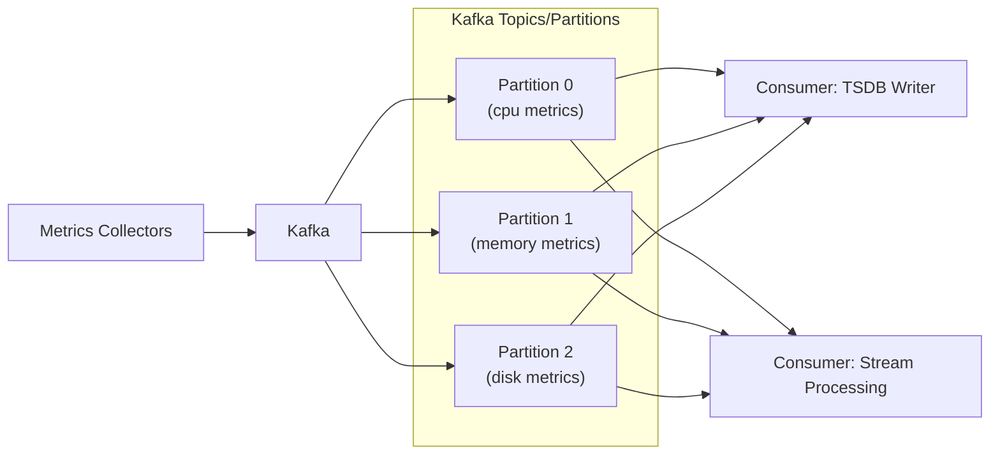

## Summary

A **Kafka-based queue** between metrics collectors and the time-series database decouples data ingestion from storage, prevents data loss during DB outages, and enables partitioning by metric name or labels for parallel processing. Kafka's built-in partitioning allows scaling throughput, prioritizing critical metrics, and supporting multiple downstream consumers (storage, alerting, streaming analytics).

## How It Works

1. Metrics collectors (pull or push) send data points to Kafka topics
2. Data is **partitioned by metric name** for parallel processing
3. Further partitioning by tags/labels enables finer-grained parallelism
4. **Consumers** (TSDB writers, stream processors) read from partitions
5. If the time-series DB is down, data is **retained in Kafka** until it recovers
6. Critical metrics can be sent to a **high-priority topic** for faster processing

## When to Use

- Large-scale monitoring systems with millions of metrics and potential DB bottlenecks
- When you need to decouple collection from storage for independent scaling
- Systems that require guaranteed delivery even during storage outages
- When multiple consumers need the same metrics stream (storage + real-time alerting + analytics)

## Trade-offs

| Aspect | Benefit | Cost |
|---|---|---|
| Kafka in pipeline | Reliable, scalable, loss-tolerant | Operational complexity of running Kafka |
| No Kafka (Gorilla-style) | Simpler architecture, lower latency | Risk of data loss on partial failure |
| Partition by metric name | Enables metric-level parallel processing | Hot metrics may overload partitions |
| Partition by labels | Finer parallelism, pre-aggregation | More partitions to manage |
| Priority topics | Critical metrics processed first | Additional topic management |

## Real-World Examples

- **LinkedIn**: Kafka was originally built for exactly this use case -- metrics pipeline
- **Uber**: uses Kafka to buffer metrics between collectors and M3 (time-series store)
- **Netflix**: Atlas monitoring pipeline uses Kafka for metric ingestion
- **Facebook Gorilla**: skips Kafka, writes directly to in-memory TSDB (alternative approach)

## Common Pitfalls

- Not partitioning by metric name -- prevents parallel aggregation by consumers
- Under-provisioning Kafka partitions for the write volume
- Not setting up Kafka consumer lag monitoring (ironic: monitoring your monitoring pipeline)
- Ignoring the operational cost of maintaining production Kafka (consider managed services)

## See Also

- [[pull-vs-push-collection]] -- the data source feeding into the pipeline
- [[time-series-database]] -- the destination for pipeline data
- [[alerting-system]] -- another consumer of the pipeline
