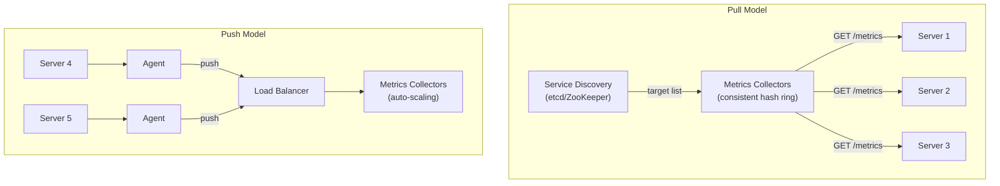

## Summary

Metrics can be collected via a **pull model** (collectors periodically fetch /metrics endpoints, as in Prometheus) or a **push model** (agents on each server send metrics to a collector cluster behind a load balancer, as in CloudWatch). Pull is better for debugging and health checks; push works better through firewalls and for short-lived jobs. Large organizations typically support both. A **consistent hash ring** can distribute pull targets across multiple collectors to avoid duplicates.

## How It Works

**Pull model:**
1. Metrics collector discovers targets via **service discovery** (etcd, ZooKeeper)
2. Collectors are assigned targets via **consistent hashing** to avoid duplicates
3. Periodically fetch metrics from `/metrics` HTTP endpoint on each target
4. Receives change notifications when service endpoints change

**Push model:**
1. A **collection agent** is installed on each monitored server
2. Agent aggregates metrics locally (e.g., counters every minute)
3. Agent pushes metrics to a load-balanced collector cluster
4. Collector cluster auto-scales based on CPU load

## When to Use

| Model | Best For |
|---|---|
| Pull | Environments where all endpoints are reachable; easy health checking |
| Push | Firewalled environments, serverless/short-lived jobs, NAT traversal |
| Both | Large organizations with mixed infrastructure |

## Trade-offs

| Aspect | Pull | Push |
|---|---|---|
| Debugging | Easy -- browse /metrics on laptop | Harder -- ambiguous failure source |
| Health check | No response = server is down | Could be network, not server |
| Short-lived jobs | May miss them (needs push gateway) | Natural fit |
| Firewalls/NAT | Requires endpoint reachability | Works anywhere via load balancer |
| Data authenticity | Collectors fetch from known targets | Need whitelisting or auth |
| Latency | TCP-based, slightly higher | UDP option for lower latency |
| Scalability | Consistent hashing across collectors | Auto-scaling collector cluster |

## Real-World Examples

- **Prometheus**: pull-based; uses service discovery; push gateway for short-lived jobs
- **Amazon CloudWatch**: push-based; agents send metrics to CloudWatch endpoint
- **Graphite**: push-based; statsd agents aggregate and push
- **Datadog**: push-based agent with auto-discovery
- **InfluxDB Telegraf**: supports both pull (input plugins) and push (listener plugins)

## Common Pitfalls

- Running pull collectors without consistent hashing -- leads to duplicate data from overlapping pull targets
- Not using a push gateway for batch/cron jobs in a pull-based system
- Push agents buffering too much data locally when the collector is unreachable (risk of data loss on auto-scaling)
- Not registering for service discovery change events (missing new servers)

## See Also

- [[time-series-data-model]] -- what the collected data looks like
- [[metrics-transmission-pipeline]] -- where collected data goes next
- [[alerting-system]] -- consumes the data collected by these models
