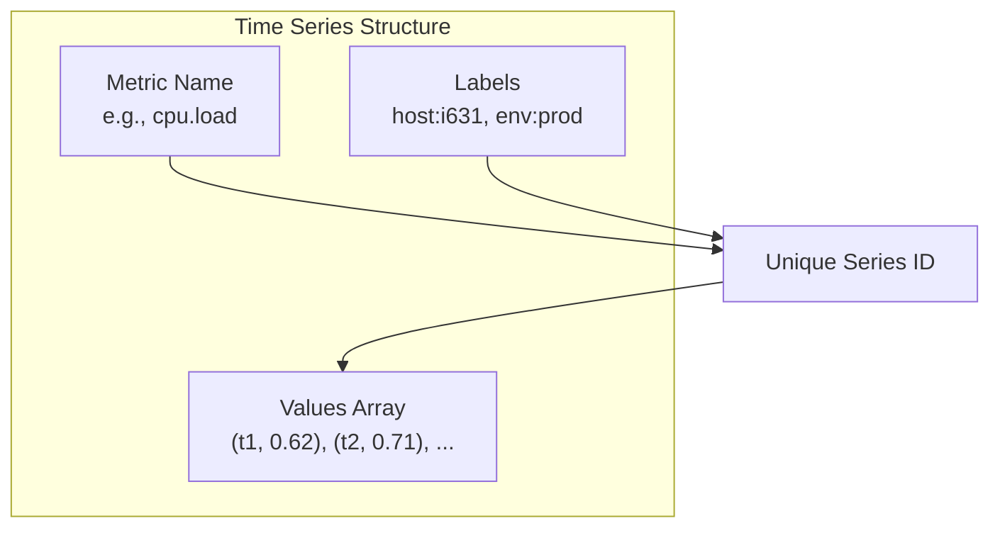

## Summary

Metrics are stored as **time series**, each uniquely identified by a metric name and a set of key-value **labels** (tags). Each series contains an array of (timestamp, value) pairs. The **line protocol** format -- `metric_name label1=v1,label2=v2 timestamp value` -- is the common input format used by InfluxDB, Prometheus, and OpenTSDB. Labels must be low cardinality for efficient indexing.

## How It Works

1. Each time series is defined by the combination of **metric name + label set**
2. A data point is a (timestamp, value) pair appended to the series
3. The line protocol encodes all components in a single line: `cpu.load host=web01,region=us-west 1613707265 54`
4. Time-series databases build **indexes on labels** for fast lookup
5. Labels should have **low cardinality** (small set of possible values) to keep indexes efficient
6. Queries filter by labels and aggregate values over time windows

## When to Use

- Infrastructure monitoring (CPU, memory, disk, network metrics)
- Application performance monitoring (request count, latency percentiles)
- IoT sensor data with tagged devices and locations
- Any domain with continuous numerical measurements over time

## Trade-offs

| Aspect | Benefit | Cost |
|---|---|---|
| Label-based indexing | Fast multi-dimensional queries | High-cardinality labels explode index size |
| Line protocol format | Simple, human-readable, widely supported | Less compact than binary formats |
| Metric name + labels as ID | Flexible, self-describing | Schema-less can lead to inconsistency |
| Low-cardinality labels | Efficient indexing and aggregation | Limits what can be used as a label |

## Real-World Examples

- **Prometheus**: metric name + label set as series identifier, PromQL for queries
- **InfluxDB**: measurement name + tag set + field set, Flux query language
- **OpenTSDB**: metric name + tags, stored on HBase
- **Datadog**: custom metrics with tags for multi-dimensional filtering

## Common Pitfalls

- Using high-cardinality values as labels (e.g., user IDs, request IDs) -- explodes index size
- Not standardizing metric naming conventions across teams
- Confusing labels/tags with fields -- labels are indexed, fields are not (in some databases)
- Storing raw event data as time series when a log store (ELK) would be more appropriate

## See Also

- [[time-series-database]] -- the storage system optimized for this data model
- [[pull-vs-push-collection]] -- how data points are gathered and ingested
- [[downsampling-and-retention]] -- how time series are compressed over time
