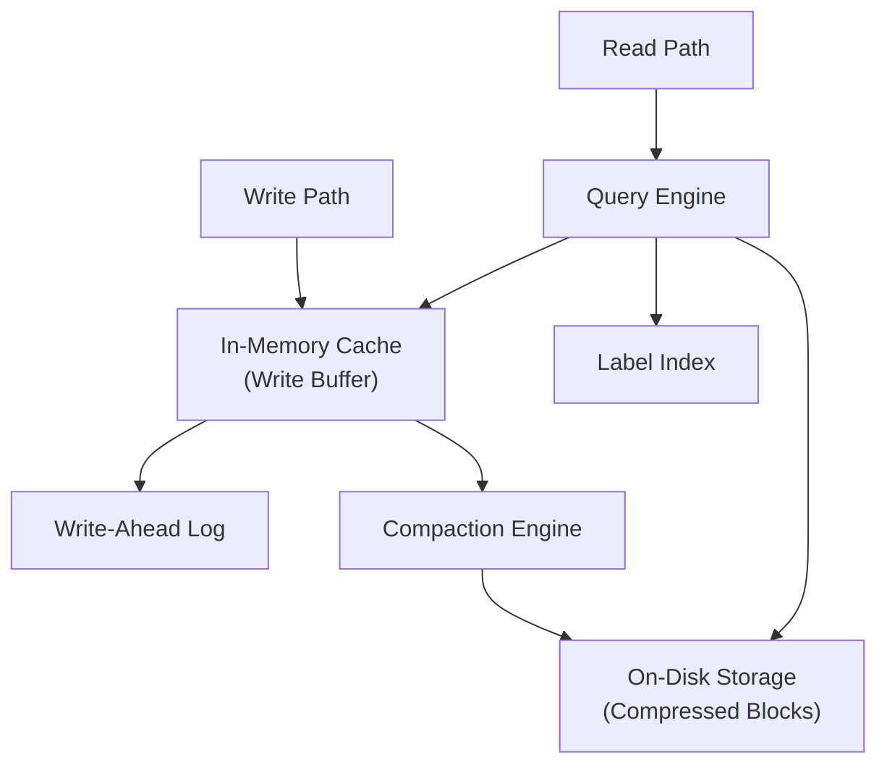

## Summary

A **time-series database** (TSDB) is a specialized storage system optimized for write-heavy, append-mostly metric workloads with label-based querying. Unlike general-purpose databases, TSDBs provide custom query languages (Flux, PromQL), built-in aggregation functions, automatic data retention policies, and label indexing. InfluxDB on 8 cores / 32 GB RAM handles over 250,000 writes/sec -- far beyond what a relational or NoSQL database could achieve for this workload without significant tuning.

## How It Works

1. Incoming data points are buffered in an **in-memory cache** and a write-ahead log
2. **Label indexes** enable fast lookup of series by any combination of tags
3. Periodically, in-memory data is **compacted** and flushed to disk in compressed blocks
4. Custom query languages (Flux, PromQL) support time-windowed aggregations natively
5. Built-in **retention policies** automatically delete or downsample old data
6. Queries leverage the access pattern: 85% of queries hit data from the last 26 hours

## When to Use

- Large-scale infrastructure monitoring (thousands of servers, millions of metrics)
- Any workload with constant high write volume and spiky reads (dashboards, alerts)
- When you need time-windowed aggregations (moving averages, percentiles, rate of change)
- When data retention policies with automatic downsampling are required

## Trade-offs

| Aspect | Benefit | Cost |
|---|---|---|
| Specialized TSDB | Optimized writes, built-in aggregation | Another system to operate and maintain |
| General-purpose SQL | Familiar, existing infrastructure | Poor performance for time-series patterns |
| NoSQL (Cassandra) | Can handle time-series with proper schema | Requires deep expertise for schema design |
| In-memory + disk hybrid | Hot data fast, cold data cheap | Memory is the bottleneck for cardinality |
| Custom query language | Easier time-series operations | Learning curve, vendor lock-in |

## Real-World Examples

- **InfluxDB**: open-source TSDB with Flux query language, used widely for DevOps monitoring
- **Prometheus**: pull-based monitoring with built-in TSDB and PromQL
- **OpenTSDB**: distributed TSDB built on Hadoop/HBase
- **Twitter MetricsDB**: custom in-house time-series store
- **Amazon Timestream**: fully managed serverless TSDB
- **Facebook Gorilla**: in-memory TSDB prioritizing write availability

## Common Pitfalls

- Trying to use MySQL or PostgreSQL for time-series at scale (write amplification, slow aggregations)
- Not leveraging built-in retention and downsampling policies
- High-cardinality labels causing memory/index explosion (e.g., using user_id as a tag)
- Ignoring the 85% rule (most queries are recent data) when choosing storage architecture

## See Also

- [[time-series-data-model]] -- the data format stored in the TSDB
- [[downsampling-and-retention]] -- built-in TSDB features for managing data lifecycle
- [[metrics-transmission-pipeline]] -- how data gets into the TSDB
