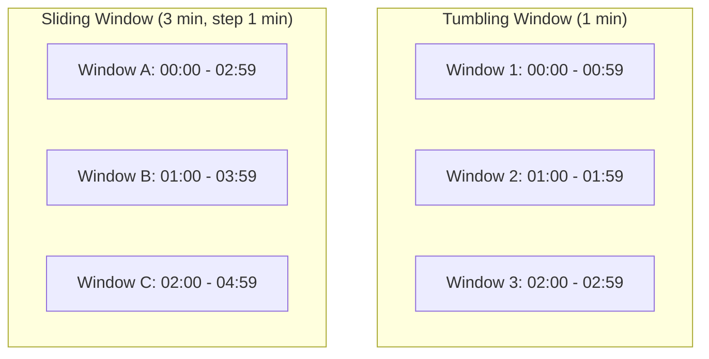

## Summary

**Window functions** define how streaming events are grouped in time for aggregation. A **tumbling window** (fixed window) partitions time into equal, non-overlapping intervals -- ideal for per-minute ad click counts. A **sliding window** overlaps and moves by a step -- ideal for "top N most clicked ads in the last M minutes." The choice of window directly impacts result freshness, compute cost, and query semantics.

## How It Works

1. **Tumbling window**: time is divided into fixed, non-overlapping intervals (e.g., every 1 minute)
   - Each event belongs to exactly one window
   - At window close, emit the aggregated result (click count per ad_id)
2. **Sliding window**: a window of size M slides by step S
   - Events may belong to multiple overlapping windows
   - At each step, emit the result (e.g., top 100 ads in the last M minutes)
3. Windows are typically combined with **watermarks** to handle late-arriving events
4. Each window type uses the MapReduce DAG -- Map partitions, Aggregate counts, Reduce merges

## When to Use

| Window Type | Use Case | Example |
|---|---|---|
| **Tumbling** | Fixed-interval counts, non-overlapping | Clicks per ad per minute |
| **Sliding** | Moving aggregates, overlapping | Top 100 ads in last 5 minutes |
| **Session** | Activity-based grouping | User session analytics |
| **Hopping** | Sliding with discrete steps | Hourly averages computed every 15 min |

## Trade-offs

| Aspect | Benefit | Cost |
|---|---|---|
| Tumbling window | Simple, each event in one window | Cannot answer "last N minutes" queries |
| Sliding window | Answers rolling queries naturally | Higher compute (events in multiple windows) |
| Short window (1 min) | Fresh results, low latency | More output records, higher write load |
| Long window (1 hr) | Fewer records, lower cost | Stale results, higher memory usage |
| Watermark extension | Captures late events | Delays window closure |

## Real-World Examples

- **Apache Flink**: native support for tumbling, sliding, session, and global windows
- **Kafka Streams**: TimeWindows (tumbling) and SlidingWindows APIs
- **Google Dataflow**: fixed, sliding, and session windows with automatic watermarking
- **Spark Structured Streaming**: window() function for tumbling and sliding aggregation

## Common Pitfalls

- Using only tumbling windows when the business needs rolling/sliding aggregates
- Setting window size too large, causing high memory usage in Aggregate nodes
- Forgetting that sliding windows multiply the compute cost by (window_size / step_size)
- Not combining windows with watermarks when using event time (leads to incorrect counts)

## See Also

- [[event-time-vs-processing-time]] -- how timestamps interact with window boundaries
- [[mapreduce-aggregation]] -- the DAG that executes within each window
- [[stream-processing-pipeline]] -- the Kafka infrastructure feeding windowed aggregation
