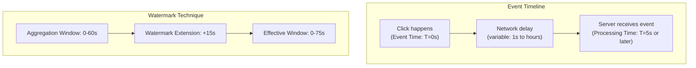

## Summary

When aggregating ad click events, the choice of timestamp matters. **Event time** (when the click occurred on the client) provides accurate billing data but requires handling late-arriving events. **Processing time** (when the server receives the event) is simpler but can miscount clicks that arrive delayed. The **watermark** technique extends aggregation windows by a configurable duration to capture slightly late events, balancing accuracy against latency.

## How It Works

1. Each ad click carries an **event timestamp** generated on the client device
2. Due to network delays and async queuing, events may arrive seconds to hours late
3. If using event time, an event arriving at T=62s with event time T=55s would miss the 0-60s window
4. **Watermarks** extend the window by a configurable period (e.g., 15s), so the window closes at T=75s
5. Events arriving after the watermark are dropped or handled in the next reconciliation cycle
6. End-of-day **batch reconciliation** catches any remaining discrepancies

## When to Use

- **Event time**: when accuracy matters (billing, financial reporting, ad click counting)
- **Processing time**: when simplicity matters and slight inaccuracies are acceptable
- **Watermarks**: when using event time and you need to bound the latency while capturing most late events

## Trade-offs

| Aspect | Benefit | Cost |
|---|---|---|
| Event time | Accurate -- reflects real user action | Must handle late events; client clocks may be wrong |
| Processing time | Simple -- no late event handling | Inaccurate for delayed events |
| Short watermark (5s) | Low added latency | May miss more late events |
| Long watermark (60s) | Captures more late events | Adds 60s to end-to-end latency |
| No watermark | Simplest implementation | Loses all late events |
| Batch reconciliation | Catches remaining errors | Only runs end-of-day; not real-time |

## Real-World Examples

- **Apache Flink**: first-class support for event time processing with watermarks
- **Apache Kafka Streams**: supports event-time windowing via TimestampExtractor
- **Google Cloud Dataflow**: event time processing with automatic watermark advancement
- **Ad billing systems**: universally use event time for accurate advertiser charges

## Common Pitfalls

- Using processing time for billing data (can result in millions of dollars in discrepancies)
- Setting watermarks too short for the actual network delay distribution (drops valid events)
- Not implementing end-of-day reconciliation as a safety net for watermark misses
- Trusting client timestamps blindly without any validation (malicious actors can send fake timestamps)

## See Also

- [[aggregation-windows]] -- tumbling and sliding windows that work with event time
- [[exactly-once-processing]] -- ensuring accurate counts even with late events
- [[stream-processing-pipeline]] -- the infrastructure where event time processing happens
